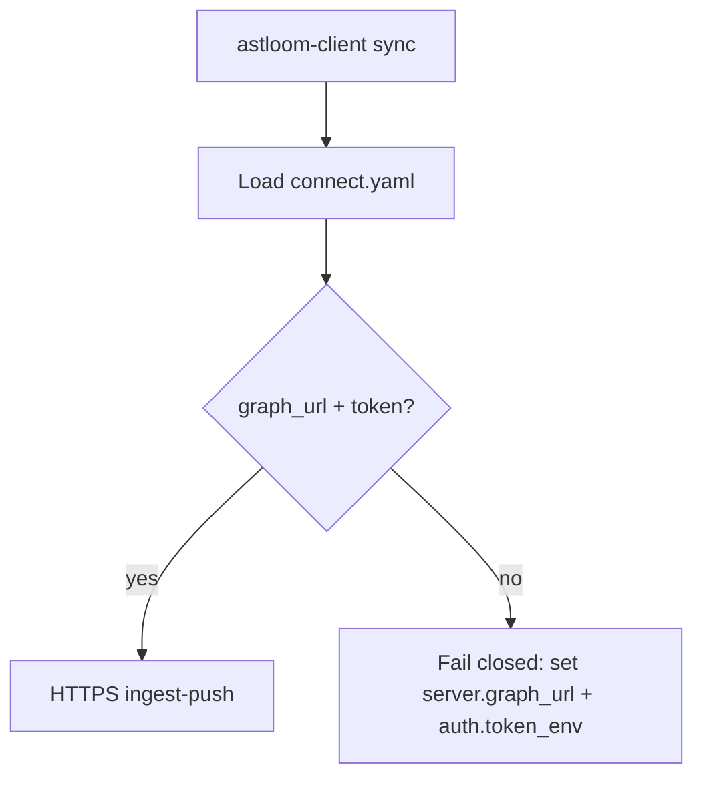
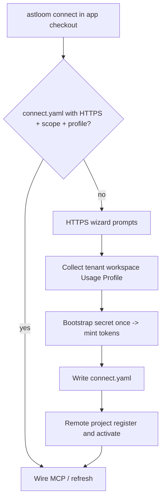

# 41 - One-Command Cross-Platform Agent Onboarding (Continued)

## Purpose

Continuation of [41-one-command-cross-platform-agent-onboarding.md](./41-one-command-cross-platform-agent-onboarding.md) after the soft size budget. Owns the **first-connect scope wizard** contract, **client content-push sync** over HTTPS, connect HTTP APIs, troubleshooting, and implementation status.

## First connect when scope is missing

When an operator runs `astloom connect` from an application checkout on a **TTY** and scope is not already configured, connect **must** collect the missing values interactively, then register the project and wire MCP. It does **not** invent tenant/workspace silently, and it does **not** author a new Usage Profile template on the client. The shipped catalog currently has a **single** Usage Profile (`programming-cursor-mcp`), which connect auto-selects.

### When the wizard runs

| Condition | Behavior |
| --- | --- |
| No `<checkout>/.astloom/connect.yaml` (and no usable legacy home config) | Full HTTPS wizard + scope prompts |
| `connect.yaml` exists but `usage_profile` empty | Auto-select sole catalog profile; otherwise prompt (TTY) or require `--usage-profile` |
| `connect.yaml` already has `scope.*` + `usage_profile` + a working HTTPS/local transport | Reuse; no re-prompt for tenant/workspace/profile |
| Non-interactive / no TTY and profile missing | Fail closed: pass `--usage-profile` (and scope flags as needed) |

`astloom init` remains the **server/dogfood** path for pinning software roots on an Astloom checkout. Remote **client** first connect does not require a prior `init` on the laptop; the wizard + `project register` establish scope on the Astloom server.

### Prompts and defaults

```text
cd /opt/MyApp
astloom connect
```

Typical interactive order:

1. Server URL (`https://…`)
2. Tenant id (default `default` if the operator accepts the empty default)
3. Workspace id (default `default`)
4. Usage Profile — auto-selected when the catalog has one entry; otherwise numbered list
5. Bootstrap secret **once** (authenticates the first connect only; never stored)
6. Write/merge `<checkout>/.astloom/connect.yaml`, mint a long-lived scoped access token via bootstrap (server stores SHA-256 digest only), register/activate project on the server, write IDE MCP configs

| Field | Source when missing | Notes |
| --- | --- | --- |
| `scope.tenant` | Wizard prompt | Operator-chosen id string |
| `scope.workspace` | Wizard prompt | Operator-chosen id string |
| `scope.project` | Current directory name | Override with `--project` |
| `usage_profile` | Sole catalog entry, else `prompt_usage_profile` | Select only — list with `astloom profile list` |
| `server.url` | Wizard prompt | Must be `https://` (or `--local`) |
| `source.server_path` | Operator-set explicitly in `connect.yaml` (no auto-probe); not required for sync | Used when set / for local `--local` cwd; empty → content-push |
| `server.graph_url` | Optional graph HTTPS base | With bearer token → HTTP content-push |

### Invariant: client remote sync transport

**Default** (`astloom-client sync`): **content-push** — discover on the client (default **auto** full tree up to 20 000 files), send changed file bodies in size-capped HTTP batches (and optional human docs) to server `ingest-push`. No durable checkout is copied onto the Astloom host. Designs: [client-direct-ingest-no-stage](../../superpowers/specs/2026-08-04-client-direct-ingest-no-stage-design.md), [auto discovery + inventory prune](../../superpowers/specs/2026-08-10-client-sync-auto-discovery-inventory-design.md).

| Rule | Detail |
| --- | --- |
| Content-push | Local `discover_source_files` + hash skip via `file-hashes` → HTTP `ingest-push` |
| Discovery | Omit `max-file` → auto/`HARD_SYNC_MAX_FILES`; explicit `max-file N` caps; note shows `max_files=auto/20000` |
| Batching | Multiple `push batch i/N` when payload exceeds ~4 MiB or 1500 files — batch size ≠ discovery cap |
| Live progress | Each `ingest-push` batch opts into an NDJSON stream (`Accept: application/x-ndjson`); client renders the same `SyncProgressTracker` lines as local `astloom sync` (percent, ETA, symbols, docs phase). Design: [client-push-progress-stream](../../superpowers/specs/2026-08-05-client-push-progress-stream-design.md) |
| Docs push | When sync docs filters enabled, last batch includes `docs[]` for `upsert_human_documentation` |
| Prune | Last batch sends `present_paths` + `inventory_complete=true` only for full unscoped discovery; otherwise `prune=off` |
| HTTP | `server.graph_url` + `ASTLOOM_CONNECT_TOKEN` / token; required (only transport) |
| Connect ingest | Same content-push path when HTTPS is ready |
| Server watch | On Astloom host: `astloom sync jobs` / `astloom sync jobs <job_id>` |
| Never | Silently fall back to Astloom host identity pins; never rsync-stage a durable mirror |
| Fail closed | Missing `graph_url`/token, or ingest-push failure; path traversal / absolute paths rejected server-side |
| Secrets floor | Client skips `.env*`, pem/key material, and common credential filenames |

Trust boundary is **HTTPS with a bearer token**. Do not expose `ingest-push` publicly without TLS. Cloud LLM routes still require local TTY consent.



| Step | Actor | Action | Outcome |
| --- | --- | --- | --- |
| 1 | Operator | Runs `astloom-client sync` under the app checkout | Client remote path (no local Compose stack) |
| 2 | CLI | Loads `connect.yaml` | Scope + `graph_url` known |
| 3 | CLI | Discovers tree (auto unless `max-file`); content-push batches to `ingest-push` (+ optional docs); prune only if inventory complete | Graph updated without an on-server checkout |

### Flow



| Step | Actor | Action | Outcome |
| --- | --- | --- | --- |
| 1 | Operator | Runs `astloom connect` under the app repo | Starts client onboarding |
| 2 | CLI | Detects missing config / incomplete scope | Enters interactive wizard on TTY |
| 3 | Operator | Enters server URL, tenant, workspace | Scope ids chosen; profile auto if sole |
| 4 | CLI | Bootstrap secret once → long-lived access token (hash at rest) | HTTPS transport ready |
| 5 | CLI | Writes `connect.yaml`; `project register` / `activate` on server | Scope exists in Astloom state |
| 6 | CLI | Merges MCP client configs | IDE can talk to Astloom after reload |

### Non-interactive equivalent

```bash
astloom connect --usage-profile programming-cursor-mcp \
  --tenant acme --workspace eng \
  --server https://astloom.example.internal
```

Or set `scope` + `usage_profile` in `.astloom/connect.yaml` and re-run `astloom connect`.

### What is not created here

- New Usage Profile **templates** (catalog ships with the CLI; choose an existing id)
- A second identity via `astloom init` unless you are dogfooding on the Astloom checkout itself
- A durable rsync mirror of the client checkout on the Astloom host

## APIs (when `server.url` is set)

| Method | Path | Purpose |
| --- | --- | --- |
| `POST` | `/api/v1/projects/{project_id}/connect/bootstrap` | Register + activate + MCP descriptor |
| `POST` | `/api/v1/projects/{project_id}/connect/sources` | Register server path / git |
| `POST` | `/api/v1/projects/{project_id}/connect/ingest` | Request ingest |
| `GET` | `/api/v1/projects/{project_id}/connect/status` | Status |
| `GET` | `/health` | Liveness |

Details: [usage-profile-api.md](../../backend/services/project-profile-service/docs/usage-profile-api.md).

## Troubleshooting

| Symptom | Likely cause | Fix |
| --- | --- | --- |
| `HTTP smoke failed` | `serve-http` down or bad token | Start `astloom mcp serve-http`; check `ASTLOOM_MCP_TOKEN_SECRET` |
| Tools empty / wrong project | Wrong scope | Check `tenant` / `workspace` / project id (= cwd name unless set) |
| Connect exits: Usage Profile required | Empty catalog / multi-profile without flag | Pass `--usage-profile ID` or run interactively; `astloom profile list` |
| Ingest / connect / sync fails: remote ingest-push failed | HTTP or server graph ingest error | Fix `graph_url`/token; check server logs; re-run sync |
| `astloom-client sync`: content-push requires server.graph_url + auth token | Missing transport | Set `server.graph_url` + `auth.token_env` in `connect.yaml` |
| `error: server.ssh=… but SSH has been removed` | Legacy `connect.yaml` with `server.ssh` and no HTTPS | Set `server.url` / `server.mcp_http_url`, or remove `server.ssh` |
| `astloom: command not found` | PATH | New shell after install; `astloom path install` |

## Implementation status

| Capability | Status |
| --- | --- |
| `astloom connect` + `connect.yaml` | Shipped |
| Client content-push (`ingest-push`; no durable sources mirror) | Shipped |
| Auto full-tree discovery (default; hard cap 20 000) + HTTP batching | Shipped |
| Inventory-complete prune (`present_paths` only when authoritative) | Shipped |
| Server `astloom sync jobs` live watch | Shipped |
| Content-push live progress (NDJSON `ingest-push` stream) | Shipped |
| HTTP content-push (`server.graph_url` + bearer) | Shipped |
| Content-push HTTP bearer gate (`ASTLOOM_CODE_GRAPH_HTTP_TOKEN`) | Shipped |
| Docs push on content-push last batch | Shipped |
| Connect ingest via content-push | Shipped |
| Sibling `Astloom-data` root for Postgres/Neo4j/usage/cache/backup | Shipped |
| Interactive scope + Usage Profile on first connect | Shipped |
| HTTP MCP (`serve-http`, port `32500`) | Shipped |
| Bootstrap / sources / ingest / status APIs | Shipped |
| Multi-client MCP file merge | Shipped |
| SSH transport (stdio, remote wiring, content-push fallback) | Removed |

## Coding-agent files written

With `--clients all` (default), connect merges into project-scoped files under the app repo:

| `client_id` | Path |
| --- | --- |
| `cursor` | `.cursor/mcp.json` |
| `windsurf` | `.windsurf/mcp.json` |
| `vscode` | `.vscode/mcp.json` |
| `claude-code` | `.mcp.json` |
| `continue` | `.continue/mcp.json` |
| `fragment` | `.astloom/mcp-servers.json` |

User-global targets (`cursor-user`, `claude-desktop`) only with `--include-user-clients`.

## Concurrent agents

| Layer | Behavior |
| --- | --- |
| **Local stdio** | Each IDE session spawns its own MCP process on the same checkout |
| **HTTPS** | Each session is a separate authenticated HTTP client; gateway is multi-request / concurrent |
| **Data** | Same `tenant/workspace/project` shares Postgres/Neo4j stores |
| **Different products** | Use different `scope.project` values |

## Security (operator rules)

1. **Never** put OS passwords or database passwords in `connect.yaml` or `mcp.json`.
2. Bootstrap secret authenticates the first connect **once** and mints a long-lived scoped access token; the secret itself is never stored on the client. The server stores only the token's SHA-256 digest (not plaintext). Re-auth / rotate with `astloom connect edit` (re-bootstrap).
3. `server.url` / `server.mcp_http_url` must be `https://`; plain `http://` is rejected unless `ASTLOOM_ALLOW_INSECURE_HTTP=1` is set for an explicit lab/loopback override.
4. Content-push HTTP (`server.graph_url`): set matching `ASTLOOM_CODE_GRAPH_HTTP_TOKEN` on the graph service and client bearer (`ASTLOOM_CONNECT_TOKEN` / `auth.token_env`). Do not expose `ingest-push` publicly.
5. Prefer scoped tokens (`ASTLOOM_MCP_TOKEN_SECRET`) over a single shared `ASTLOOM_MCP_HTTP_TOKEN`.
6. Keep `connect.yaml` mode `600`; do not commit live bearer tokens.

## Related Documents

- Parent: [41-one-command-cross-platform-agent-onboarding.md](./41-one-command-cross-platform-agent-onboarding.md)
- Normative HTTPS/auth: [2026-08-04-api-only-https-no-ssh-design.md](../superpowers/specs/2026-08-04-api-only-https-no-ssh-design.md)
- [35-usage-profile-and-cursor-mcp-onboarding.md](./35-usage-profile-and-cursor-mcp-onboarding.md)
- [40-remote-dev-client-mcp-wiring.md](./40-remote-dev-client-mcp-wiring.md)
- [36-astloom-cli.md](./36-astloom-cli.md)
- [39-local-install-runbook.md](./39-local-install-runbook.md)
- [backend/services/mcp-gateway-service/README.md](../../backend/services/mcp-gateway-service/README.md)
