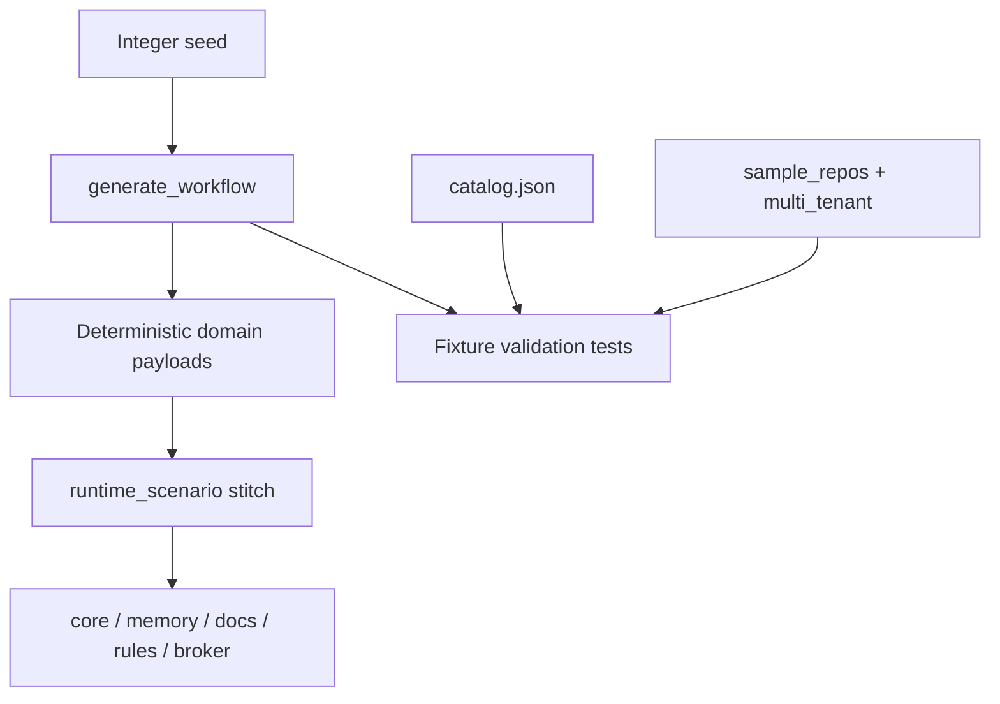

# 51 - Test Fixture Catalog

## Purpose

Define how Astloom shares, classifies, and validates **test fixtures** so graph,
memory, rules, broker, docs-drift, and security suites stop inventing ad-hoc data that
hides isolation and coverage gaps (GAP-T08).

This document is the normative map for:

| Artifact | Path |
| --- | --- |
| Machine catalog | `tests/backend/fixtures/catalog.json` |
| Sample mini-repos | `tests/backend/fixtures/sample_repos/` |
| Multi-tenant negatives | `tests/backend/fixtures/multi_tenant/` |
| Synthetic workflow generator | `tests/support/synthetic_workflow.py` |
| Technical-logic stitch consumer | `tests/support/technical_logic/runtime_scenario.py` |

## Goals And Non-Goals

### Goals

- One catalog entry per shared fixture with owner, scope, classification, and families.
- Deterministic synthetic workflows from an integer seed (same seed → same payloads).
- Explicit multi-tenant negative packs for cross-scope leak regressions.
- Enforce a **no-secrets** policy on cataloged fixture trees.

### Non-Goals

- Replacing service-local builders that are not reused across owners.
- Shipping customer data, production dumps, or live credentials as fixtures.
- Making Live suites the only place realistic data exists.

## Classification And Families

### Classification (closed set)

| Value | Meaning |
| --- | --- |
| `synthetic` | Generated or hand-authored fake domain payloads (no real customer content) |
| `sample` | Tiny representative source trees or payloads for parsers / ingest |
| `negative` | Fixtures that must be rejected, isolated, or fail closed |

### Families (closed set)

`graph` · `memory` · `rules` · `broker` · `docs-drift` · `security`

A fixture may list multiple families when it is intentionally cross-cutting.

### Catalog fields

Each `catalog.json` fixture entry **must** include:

| Field | Rule |
| --- | --- |
| `id` | Stable kebab-case id |
| `path` | Repo-relative path under `tests/backend/fixtures/` |
| `owner` | Team or role slug (for example `platform-engineering`) |
| `scope` | `unit` · `integration` · `e2e` · `live` · `gate` |
| `classification` | `synthetic` · `sample` · `negative` |
| `families` | Non-empty subset of the closed family set |
| `description` | One English sentence |

Root policy object must set `no_secrets: true` and enumerate allowed classifications/families.

## No-Secrets Policy

Normative rules for everything listed in the catalog:

1. No production credentials, API keys, private keys, session cookies, or bearer tokens.
2. No customer PII or production payloads (even “redacted” dumps that still look real).
3. Auth fields in synthetic workflows use explicit placeholders such as
   `fixture-auth-placeholder` — never values containing `secret`, `password=`, or key material.
4. Domain language that *talks about* passwords or hashing (security scenarios) is allowed;
   literal secret material is not.
5. Validation tests under `tests/backend/fixtures/` must fail the suite when secret-looking
   strings appear in cataloged fixture files.

## Sample Mini-Repos

Shared language samples live under `tests/backend/fixtures/sample_repos/`:

| Repo | Languages | Primary families |
| --- | --- | --- |
| `python_mini` | Python | `graph` |
| `typescript_mini` | TypeScript | `graph` |

Keep them tiny (a few source files). They exist for ingest, parsing, and cross-language
resolution tests — not as full applications.

## Multi-Tenant Negative Pack

`tests/backend/fixtures/multi_tenant/` holds **negative** cases that assert isolation:

- Wrong `tenant_id` must not read foreign memory / graph / rules / broker events.
- Same tenant, wrong `project_id` or `workspace_id` must still fail closed.
- Pack files declare actor scopes and expected outcome (`deny` / `empty` / `error`).

Use these packs from security and isolation tests; do not invent one-off foreign scopes
when a cataloged case already covers the boundary.

## Synthetic Workflow Generator



| Step | Actor | Action | Outcome |
| --- | --- | --- | --- |
| 1 | Test author | Choose seed (+ optional correlation id) | Stable scenario identity |
| 2 | `generate_workflow` | Expand template from seed | Payloads for all owned services |
| 3 | `run_runtime_scenario` | Stitch services in-process | Evidence chain + pass/fail report |
| 4 | Validation suite | Re-generate twice; scan fixtures | Determinism + no-secrets gate |

`tests/support/synthetic_workflow.py` is the source of truth for scenario templates.
`runtime_scenario.py` **must** consume the generator instead of hardcoding payload strings.
Default `seed=0` preserves the classic security-migration stitch used by the technical-logic gate.

## Ownership And Placement

| Kind | Location |
| --- | --- |
| Shared cataloged fixtures | `tests/backend/fixtures/` |
| Cross-suite generators / gates | `tests/support/` |
| Single-owner locals | Beside the owning test module (not in the catalog) |

Promote a builder into `tests/support/` or `tests/backend/fixtures/` only when a second owner
reuses it.

## Verification

- [x] `catalog.json` validates against the schema rules in this document.
- [x] `generate_workflow(seed=N)` is byte-stable across two calls.
- [x] Cataloged fixture files contain no secret-looking strings.
- [x] Technical-logic runtime scenario still passes using generator payloads.
- [x] Sample repos and multi-tenant pack paths listed in the catalog exist on disk.

```bash
.venv/bin/python -m pytest tests/backend/fixtures tests/backend/gates/technical-logic-verification -q
```

## Related Documents

| Document | Role |
| --- | --- |
| `37-test-authoring-standard.md` | Concurrent tests law, placement, doubles |
| `25-live-and-unit-test-strategy.md` | Unit vs Live fixture safety |
| `33-testing-seams-and-contract-boundary-standards.md` | Seams, determinism, fakes |
| `../10-gap-analysis/03-technical-implementation-gaps.md` | GAP-T08 problem statement |
