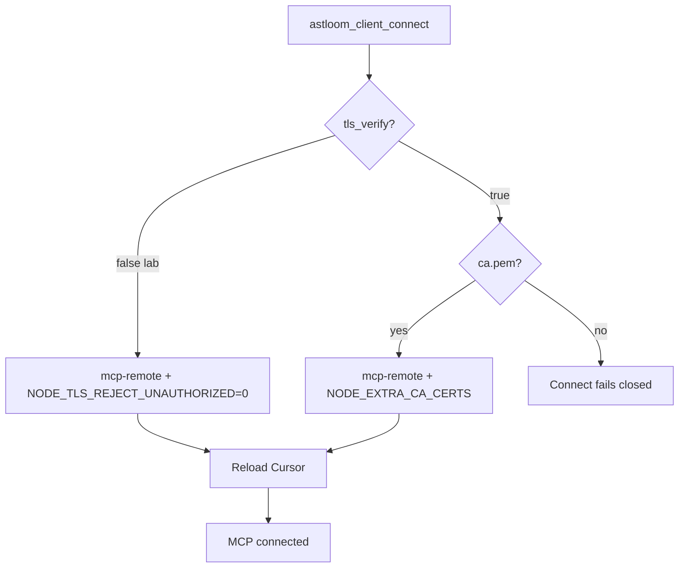

# 52 - Client TLS Trust And Certificate Verify

## Purpose

Explain how a coding-agent host (client) trusts an Astloom server over HTTPS:
what is automatic, what `auth.tls_verify` means, where CA files live, how Cursor
MCP must be wired for private auto-TLS, and how to turn verification on safely.

## What you do (operator checklist)

Use this when connecting **Cursor** (or another IDE) on a **dev host** to an
Astloom **server** that uses private auto-TLS (typical LAN lab).

### Lab default — do not verify TLS (recommended for private auto-TLS)

Leave (or set) in `<app>/.astloom/connect.yaml`:

```yaml
auth:
  tls_verify: false   # default if omitted — CLI and Cursor MCP skip cert validation
```

Then:

```bash
cd /path/to/YourApp
astloom-client connect
# Reload Cursor / reconnect Remote SSH
```

Connect writes `.cursor/mcp.json` as **stdio `npx mcp-remote`** with
`NODE_TLS_REJECT_UNAUTHORIZED=0`. Traffic stays HTTPS (encrypted); **certificates
are not validated**. You do **not** need OS trust or `ca.pem` for Cursor in this mode.

| Step | Who | Action | Done when |
| --- | --- | --- | --- |
| 1 | Server | MCP HTTPS up on `:32500` | `curl -sk https://<server>:32500/health` → 200 |
| 2 | Client host | `astloom-client` installed; `npx` available | `command -v npx` |
| 3 | App repo | `auth.tls_verify: false` (default) + `astloom-client connect` | mcp.json has `NODE_TLS_REJECT_UNAUTHORIZED=0` |
| 4 | Operator | Reload Cursor / reconnect Remote | `Astloom-Programming` green |

### Production-like — verify TLS with the Astloom CA

```yaml
auth:
  tls_verify: true
  ca_file: .astloom/certs/ca.pem
```

```bash
cd /path/to/YourApp
astloom-client connect   # needs ca.pem; writes NODE_EXTRA_CA_CERTS (no REJECT_UNAUTHORIZED)
```

| Step | Who | Action | Done when |
| --- | --- | --- | --- |
| 1–2 | Same as lab | Server + client install | — |
| 3 | App repo | `tls_verify: true` + readable `ca.pem` + connect | mcp.json has `NODE_EXTRA_CA_CERTS` |
| 4 | Linux (optional) | OS trust helper may install CA for other tools | connect notes OK / need_root |
| 5 | Operator | Reload Cursor | MCP connected |

**Important:** `auth.tls_verify` now drives **both** the Astloom CLI and the Cursor
MCP fragment. There is no separate IDE flag.

### Expected `.cursor/mcp.json` — lab (`tls_verify: false`)

```json
{
  "mcpServers": {
    "Astloom-Programming": {
      "command": "npx",
      "args": [
        "-y",
        "mcp-remote",
        "https://192.168.1.150:32500/mcp",
        "--header", "Authorization: Bearer …",
        "--header", "X-Tenant-Id: mir",
        "--header", "X-Workspace-Id: dev",
        "--header", "X-Project-Id: YourApp",
        "--header", "X-Usage-Profile: programming-cursor-mcp"
      ],
      "env": {
        "NODE_TLS_REJECT_UNAUTHORIZED": "0"
      }
    }
  }
}
```

### Expected `.cursor/mcp.json` — verify on (`tls_verify: true`)

```json
{
  "mcpServers": {
    "Astloom-Programming": {
      "command": "npx",
      "args": ["-y", "mcp-remote", "https://192.168.1.150:32500/mcp", "--header", "Authorization: Bearer …"],
      "env": {
        "NODE_EXTRA_CA_CERTS": "/absolute/path/to/ca.pem"
      }
    }
  }
}
```

A bare `"url": "https://…/mcp"` + `"headers"` block is legacy. Against Astloom
private CA it fails with `fetch failed` — re-run `astloom-client connect`.

### If MCP already shows `fetch failed`

```bash
cd /path/to/YourApp
# Ensure lab mode (skip verify) unless you intentionally pin the CA
# auth.tls_verify: false   in .astloom/connect.yaml
astloom-client connect
# Reload Cursor / reconnect Remote; toggle Astloom-Programming if needed
```



| Step | Actor | Action | Outcome |
| --- | --- | --- | --- |
| 1 | Operator | Set `tls_verify` in connect.yaml | Lab skip vs pin CA |
| 2 | CLI | `materialize_http_mcp_fragment` | mcp-remote env matches mode |
| 3 | Operator | Reload Cursor | New mcp.json loaded |
| 4 | Cursor | Spawns `npx mcp-remote` | Tools available |

## Quick answer (CLI + IDE verify modes)

| Mode | Config | CLI (httpx) | Cursor MCP |
| --- | --- | --- | --- |
| **Lab default** | `auth.tls_verify: false` | Encrypt, do not validate | `mcp-remote` + `NODE_TLS_REJECT_UNAUTHORIZED=0` |
| **Verify on** | `tls_verify: true` + `ca_file` | Validate with CA PEM | `mcp-remote` + `NODE_EXTRA_CA_CERTS` |
| **Verify on, no CA** | `tls_verify: true` without CA | Fails closed | Connect fails closed |

You do **not** paste a raw public key into `connect.yaml`. Trust material is the
server **CA certificate** (`ca.pem`), not the leaf private key.

## Topology

```text
Client app repo                         Astloom server
.astloom/connect.yaml                 {data-root}/certs/
  auth.tls_verify: false|true             ca.pem      ← trust anchor (copy to client)
  auth.ca_file: …/ca.pem                  ca.key      ← server only (never copy)
                                          server.pem  ← leaf (served by profile/graph/MCP)
                                          server.key  ← server only
.cursor/mcp.json
  lab:     npx mcp-remote + NODE_TLS_REJECT_UNAUTHORIZED=0
  verify:  npx mcp-remote + NODE_EXTRA_CA_CERTS=<ca.pem>
```

Fresh server install / `astloom service start` auto-creates those certs under the
durable data root (sibling `<install>-data` by default) when missing. Upgrade
**preserves** existing certs.

## Client config (`connect.yaml`)

Path: `<your-app>/.astloom/connect.yaml` (gitignored).

### Default — encrypt, do not verify (easiest)

```yaml
server:
  url: https://192.168.1.150:32194
  graph_url: https://192.168.1.150:32140
  mcp_http_url: https://192.168.1.150:32500
auth:
  token_env: ASTLOOM_TOKEN
  tls_verify: false          # default if omitted — CLI + Cursor MCP skip cert validation
scope:
  tenant: mir
  workspace: dev
  project: ThinkingSOC
usage_profile: programming-cursor-mcp
```

Use this for private LAN / auto-TLS labs. Traffic is still HTTPS; MITM protection
from cert validation is off. After `astloom-client connect`, Cursor gets
`NODE_TLS_REJECT_UNAUTHORIZED=0` in `.cursor/mcp.json` (see operator checklist above).

### Recommended for shared / production-like — verify with CA

1. On the **server**, copy the CA (not the private key):

```bash
# On Astloom server
sudo cat /opt/Astloom-data/certs/ca.pem
# or: scp root@astloom-host:/opt/Astloom-data/certs/ca.pem ./
```

2. On the **client** app repo:

```bash
mkdir -p .astloom/certs
# place ca.pem there (mode 0644 is fine — it is a public certificate)
cp /path/from/server/ca.pem .astloom/certs/ca.pem
```

3. Enable verify in `connect.yaml`:

```yaml
auth:
  token_env: ASTLOOM_TOKEN
  tls_verify: true
  ca_file: .astloom/certs/ca.pem
```

Absolute paths and env also work:

```bash
export ASTLOOM_CONNECT_CA_FILE=/secure/path/ca.pem
export ASTLOOM_CONNECT_TLS_VERIFY=true
```

Env overrides the YAML when set.

### Automatic CA from connect bootstrap

```bash
cd /path/to/YourApp
astloom-client connect
```

When bootstrap succeeds, the server may return `ca_pem`. The client writes
`.astloom/certs/ca.pem` and can point `auth.ca_file` at it. **Verification stays
off until you set `tls_verify: true`.**

## Server side (what starts with HTTPS)

| Service | Port (default) | TLS |
| --- | --- | --- |
| Project profile API | 32194 | HTTPS (leaf under data-root certs) |
| Code graph API | 32140 | HTTPS |
| MCP Streamable HTTP | 32500 | HTTPS by default (`ASTLOOM_MCP_TLS=0` disables) |

Set advertise host for clients:

```bash
# Server .env (example)
ASTLOOM_PUBLIC_HOSTNAME=192.168.1.150
ASTLOOM_MCP_HTTP_PUBLIC_URL=https://192.168.1.150:32500
```

Then restart MCP: `astloom service restart`.

## Cursor / IDE Streamable HTTP vs CLI ``tls_verify``

See **[What you do (operator checklist)](#what-you-do-operator-checklist)** above.
Summary:

| `auth.tls_verify` | CLI | Cursor MCP fragment |
| --- | --- | --- |
| `false` (default) | httpx does not validate | `npx mcp-remote` + `NODE_TLS_REJECT_UNAUTHORIZED=0` |
| `true` | httpx validates with `ca_file` | `npx mcp-remote` + `NODE_EXTRA_CA_CERTS` |

Bare Cursor `"url": "https://…/mcp"` always verifies and fails on private CA —
connect rewrites that away.

Symptoms of a stale bare-url config:

```text
MCP HTTP exchange failed
Transient error connecting to streamableHttp server: fetch failed
```

**Prerequisite:** Node.js with `npx` on the coding host. Optional:
`npm install -g mcp-remote` to avoid first-start download.

## Commands that honor `tls_verify`

All client HTTPS calls that go through `httpx_verify` (connect, status, sync
content-push, profile/graph helpers) use the same rule.

```bash
# Lab default — no CA required
astloom-client sync --allow-cloud-llm

# After enabling tls_verify + ca_file
astloom-client connect
astloom-client sync --allow-cloud-llm
```

Plain `http://` URLs are still rejected unless `ASTLOOM_ALLOW_INSECURE_HTTP=1`
(separate from certificate verify — that flag only allows non-TLS URLs).

## Error when verify is on without trust

If you set `tls_verify: true` but forget the CA:

```text
error: auth.tls_verify is true but no CA trust file was found.
  TLS verification needs the Astloom private CA PEM on the client.
  Fix one of:
  • auth.ca_file: /path/to/ca.pem
  • env ASTLOOM_CONNECT_CA_FILE=/path/to/ca.pem
  • re-run `astloom-client connect` so bootstrap can write .astloom/certs/ca.pem
  • copy server file {data-root}/certs/ca.pem (often /opt/Astloom-data/certs/ca.pem)
  Or set auth.tls_verify: false (default) to connect without verifying the certificate.
```

## Checklist

**Server fresh install**

1. `bash install.sh --role server` (or `get-astloom.sh`)
2. Confirm `{data-root}/certs/ca.pem` and `server.pem` exist after bring-up
3. Confirm `curl -sk https://127.0.0.1:32500/health` → 200

**Client + Cursor (private auto-TLS lab)**

1. `bash install.sh --role client` on the coding host
2. Ensure `npx` is available on that host
3. Keep `auth.tls_verify: false` (default) unless policy requires pinning the CA
4. From the **app** repo: `astloom-client connect`
5. Confirm `.cursor/mcp.json` has `NODE_TLS_REJECT_UNAUTHORIZED=0` (lab) or `NODE_EXTRA_CA_CERTS` (verify on)
6. Reload Cursor / reconnect Remote SSH; MCP `Astloom-Programming` should connect
7. For CLI+IDE verify: set `tls_verify: true` + `ca_file`, then connect again

## Troubleshooting (Cursor MCP)

| Symptom | Likely cause | Operator fix |
| --- | --- | --- |
| `fetch failed` / MCP HTTP exchange failed | Bare HTTPS `url` in mcp.json | `astloom-client connect` with `tls_verify: false` (lab) or CA + `true` |
| Connect OK but MCP still red after Reload | Stale cursor-server / old mcp.json | Reconnect Remote; toggle MCP; confirm mcp.json env |
| `npx` / `mcp-remote` spawn errors | Node/npm missing | Install Node LTS; optional `npm install -g mcp-remote` |
| Want zero cert hassle | — | Keep `auth.tls_verify: false` (default) |
| Policy requires pinned CA | — | `tls_verify: true` + `ca_file`; reconnect |

## Security notes

- `tls_verify: false` is intentional for private auto-TLS labs (CLI **and** Cursor
  MCP skip cert validation); turn verify **on** when clients leave a trusted LAN
  or when policy requires cert validation.
- `NODE_TLS_REJECT_UNAUTHORIZED=0` weakens TLS authenticity for the MCP child
  process only — prefer `tls_verify: true` + CA outside trusted labs.
- Never copy `ca.key` or `server.key` to clients.
- Rotating the server CA requires distributing the new `ca.pem` to every client
  that uses `tls_verify: true`.

## Related Documents

- [39 - Local Install Runbook](./39-local-install-runbook.md) — server install, MCP HTTPS, auth secrets
- [41 - One-Command Cross-Platform Agent Onboarding](./41-one-command-cross-platform-agent-onboarding.md) — connect wizard and MCP wiring
- [35 - Usage Profile and Cursor MCP Onboarding](./35-usage-profile-and-cursor-mcp-onboarding.md) — profile tool surface
- [API-only HTTPS design](../superpowers/specs/2026-08-04-api-only-https-no-ssh-design.md) — transport law
