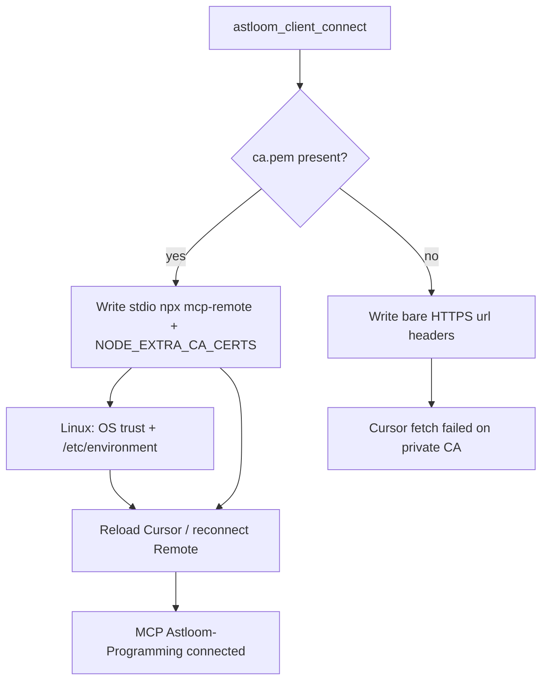

# 52 - Client TLS Trust And Certificate Verify

## Purpose

Explain how a coding-agent host (client) trusts an Astloom server over HTTPS:
what is automatic, what `auth.tls_verify` means, where CA files live, how Cursor
MCP must be wired for private auto-TLS, and how to turn verification on safely.

## What you do (operator checklist)

Use this when connecting **Cursor** (or another IDE) on a **dev host** to an
Astloom **server** that uses private auto-TLS (typical LAN lab).

| Step | Who | Action | Done when |
| --- | --- | --- | --- |
| 1 | Server | `astloom service start` (or install) so MCP HTTPS listens on `:32500` | `curl -sk https://<server>:32500/health` → 200 |
| 2 | Client host | `bash install.sh --role client` (or upgrade) so `astloom-client` is on PATH | `astloom-client doctor` OK |
| 3 | App repo | Ensure `npx` / Node are available (Cursor MCP bridge uses `npx mcp-remote`) | `command -v npx` |
| 4 | App repo | `cd /path/to/YourApp && astloom-client connect` | Connect prints Streamable HTTP notes; CA saved under `.astloom/certs/ca.pem` when bootstrap returns it |
| 5 | App repo | Confirm project MCP config is the **stdio bridge** (not a bare HTTPS `url`) | See [Expected `.cursor/mcp.json`](#expected-cursormcpjson-after-connect) |
| 6 | Operator | Reload Cursor window **or** reconnect Cursor Remote SSH | MCP panel shows `Astloom-Programming` connected (green) |
| 7 | Optional | Enable CLI cert verify for sync/API: `auth.tls_verify: true` + `auth.ca_file` | `astloom-client sync` works with verify on |

**Do not** assume `auth.tls_verify: false` fixes Cursor. That flag only affects the
Astloom CLI (httpx). Cursor’s native HTTPS `url` transport always verifies TLS.

### Happy path (copy-paste)

```bash
# On the coding host, inside the application checkout (not only /opt/Astloom)
cd /path/to/YourApp
astloom-client connect
# If connect warns about IDE TLS trust / need_root, re-run the same command as root
# once so it can install the CA + NODE_EXTRA_CA_CERTS (Linux).

# Confirm MCP shape
python3 -c "import json; e=json.load(open('.cursor/mcp.json'))['mcpServers']['Astloom-Programming']; print(e.get('command') or e.get('url'))"
# Expect: npx   (with args containing mcp-remote)
# Not only: https://…:32500/mcp

# In Cursor: Developer: Reload Window  (or reconnect Remote SSH)
# Settings → MCP → Astloom-Programming should connect
```

### If MCP already shows `fetch failed`

```text
MCP HTTP exchange failed
Transient error connecting to streamableHttp server: fetch failed
```

```bash
cd /path/to/YourApp

# 1) Ensure CA file exists (from connect bootstrap or copy from server)
test -f .astloom/certs/ca.pem || scp root@<astloom-host>:/opt/Astloom-data/certs/ca.pem .astloom/certs/

# 2) Re-run connect (rewrites mcp.json + tries OS trust)
astloom-client connect

# 3) Linux root one-shot if connect said need_root
sudo cp .astloom/certs/ca.pem /usr/local/share/ca-certificates/astloom-private-ca.crt
sudo update-ca-certificates
grep -q NODE_EXTRA_CA_CERTS /etc/environment || \
  echo 'NODE_EXTRA_CA_CERTS="/usr/local/share/ca-certificates/astloom-private-ca.crt"' | sudo tee -a /etc/environment

# 4) Fully restart Cursor Remote (kill stale cursor-server if Reload is not enough)
# then toggle Astloom-Programming off/on in the MCP panel
```

### Expected `.cursor/mcp.json` after connect

When `.astloom/certs/ca.pem` exists, connect writes a **stdio** entry (not bare `url`):

```json
{
  "mcpServers": {
    "Astloom-Programming": {
      "command": "npx",
      "args": [
        "-y",
        "mcp-remote",
        "https://192.168.1.150:32500/mcp",
        "--header", "Authorization: Bearer …",
        "--header", "X-Tenant-Id: mir",
        "--header", "X-Workspace-Id: dev",
        "--header", "X-Project-Id: YourApp",
        "--header", "X-Usage-Profile: programming-cursor-mcp"
      ],
      "env": {
        "NODE_EXTRA_CA_CERTS": "/absolute/path/to/ca.pem"
      }
    }
  }
}
```

A bare `"url": "https://…/mcp"` + `"headers"` block is the **old** shape. It works
only against publicly trusted certificates. Against Astloom private CA it fails
with `fetch failed` — re-run `astloom-client connect` after you have `ca.pem`.



| Step | Actor | Action | Outcome |
| --- | --- | --- | --- |
| 1 | Operator | `astloom-client connect` in app repo | Token + CA + MCP fragment |
| 2 | CLI | Detect `ca.pem` | Choose mcp-remote vs bare url |
| 3 | CLI | Linux trust helper | OS CA + `NODE_EXTRA_CA_CERTS` when permitted |
| 4 | Operator | Reload Cursor | Extension hosts new mcp.json |
| 5 | Cursor | Spawns `npx mcp-remote` | TLS verify uses private CA → tools available |

## Quick answer (CLI verify modes)

| Mode | Config | Behavior |
| --- | --- | --- |
| **Default (lab)** | `auth.tls_verify: false` (or omit) | CLI HTTPS encrypts; **CLI does not validate** the server cert |
| **Verify on** | `auth.tls_verify: true` + `auth.ca_file` | CLI validates the server cert against the Astloom **private CA PEM** |
| **Verify on, no CA** | `tls_verify: true` without a readable CA file | **Fails closed** with an explicit error (not a cryptic SSL stacktrace) |
| **Cursor / IDE MCP** | `ca.pem` on client + connect | **Always verifies**; use mcp-remote + `NODE_EXTRA_CA_CERTS` (see above) |

You do **not** paste a raw public key into `connect.yaml`. Trust material is the
server **CA certificate** (`ca.pem`), not the leaf private key.

## Topology

```text
Client app repo                         Astloom server
.astloom/connect.yaml                 {data-root}/certs/
  auth.tls_verify: false|true             ca.pem      ← trust anchor (copy to client)
  auth.ca_file: …/ca.pem                  ca.key      ← server only (never copy)
                                          server.pem  ← leaf (served by profile/graph/MCP)
                                          server.key  ← server only
.cursor/mcp.json
  command: npx mcp-remote + NODE_EXTRA_CA_CERTS   ← IDE path (private CA)
```

Fresh server install / `astloom service start` auto-creates those certs under the
durable data root (sibling `<install>-data` by default) when missing. Upgrade
**preserves** existing certs.

## Client config (`connect.yaml`)

Path: `<your-app>/.astloom/connect.yaml` (gitignored).

### Default — encrypt, do not verify (easiest)

```yaml
server:
  url: https://192.168.1.150:32194
  graph_url: https://192.168.1.150:32140
  mcp_http_url: https://192.168.1.150:32500
auth:
  token_env: ASTLOOM_TOKEN
  tls_verify: false          # default if omitted
scope:
  tenant: mir
  workspace: dev
  project: ThinkingSOC
usage_profile: programming-cursor-mcp
```

Use this for private LAN / auto-TLS labs. Traffic is still HTTPS; MITM protection
from cert validation is off.

### Recommended for shared / production-like — verify with CA

1. On the **server**, copy the CA (not the private key):

```bash
# On Astloom server
sudo cat /opt/Astloom-data/certs/ca.pem
# or: scp root@astloom-host:/opt/Astloom-data/certs/ca.pem ./
```

2. On the **client** app repo:

```bash
mkdir -p .astloom/certs
# place ca.pem there (mode 0644 is fine — it is a public certificate)
cp /path/from/server/ca.pem .astloom/certs/ca.pem
```

3. Enable verify in `connect.yaml`:

```yaml
auth:
  token_env: ASTLOOM_TOKEN
  tls_verify: true
  ca_file: .astloom/certs/ca.pem
```

Absolute paths and env also work:

```bash
export ASTLOOM_CONNECT_CA_FILE=/secure/path/ca.pem
export ASTLOOM_CONNECT_TLS_VERIFY=true
```

Env overrides the YAML when set.

### Automatic CA from connect bootstrap

```bash
cd /path/to/YourApp
astloom-client connect
```

When bootstrap succeeds, the server may return `ca_pem`. The client writes
`.astloom/certs/ca.pem` and can point `auth.ca_file` at it. **Verification stays
off until you set `tls_verify: true`.**

## Server side (what starts with HTTPS)

| Service | Port (default) | TLS |
| --- | --- | --- |
| Project profile API | 32194 | HTTPS (leaf under data-root certs) |
| Code graph API | 32140 | HTTPS |
| MCP Streamable HTTP | 32500 | HTTPS by default (`ASTLOOM_MCP_TLS=0` disables) |

Set advertise host for clients:

```bash
# Server .env (example)
ASTLOOM_PUBLIC_HOSTNAME=192.168.1.150
ASTLOOM_MCP_HTTP_PUBLIC_URL=https://192.168.1.150:32500
```

Then restart MCP: `astloom service restart`.

## Cursor / IDE Streamable HTTP vs CLI ``tls_verify``

See **[What you do (operator checklist)](#what-you-do-operator-checklist)** above for
the normative operator path. Summary:

| Layer | Honor `tls_verify: false`? | Trust mechanism |
| --- | --- | --- |
| `astloom-client` (connect/sync/status) | Yes | httpx `verify=False` or CA path |
| Cursor native `"url": "https://…/mcp"` | **No** — always verifies | Fails on Astloom private CA |
| Cursor after connect with `ca.pem` | N/A | stdio `npx mcp-remote` + `NODE_EXTRA_CA_CERTS` |

Symptoms of the wrong MCP shape / missing CA:

```text
MCP HTTP exchange failed
Transient error connecting to streamableHttp server: fetch failed
```

Node often reports `UNABLE_TO_VERIFY_LEAF_SIGNATURE` (and may require
`NODE_EXTRA_CA_CERTS` even after `update-ca-certificates`).

**Prerequisite:** Node.js with `npx` on the coding host (or Cursor Remote SSH
host). First `mcp-remote` start may download the package unless preinstalled
(`npm install -g mcp-remote`).

## Commands that honor `tls_verify`

All client HTTPS calls that go through `httpx_verify` (connect, status, sync
content-push, profile/graph helpers) use the same rule.

```bash
# Lab default — no CA required
astloom-client sync --allow-cloud-llm

# After enabling tls_verify + ca_file
astloom-client connect
astloom-client sync --allow-cloud-llm
```

Plain `http://` URLs are still rejected unless `ASTLOOM_ALLOW_INSECURE_HTTP=1`
(separate from certificate verify — that flag only allows non-TLS URLs).

## Error when verify is on without trust

If you set `tls_verify: true` but forget the CA:

```text
error: auth.tls_verify is true but no CA trust file was found.
  TLS verification needs the Astloom private CA PEM on the client.
  Fix one of:
  • auth.ca_file: /path/to/ca.pem
  • env ASTLOOM_CONNECT_CA_FILE=/path/to/ca.pem
  • re-run `astloom-client connect` so bootstrap can write .astloom/certs/ca.pem
  • copy server file {data-root}/certs/ca.pem (often /opt/Astloom-data/certs/ca.pem)
  Or set auth.tls_verify: false (default) to connect without verifying the certificate.
```

## Checklist

**Server fresh install**

1. `bash install.sh --role server` (or `get-astloom.sh`)
2. Confirm `{data-root}/certs/ca.pem` and `server.pem` exist after bring-up
3. Confirm `curl -sk https://127.0.0.1:32500/health` → 200

**Client + Cursor (private auto-TLS lab)**

1. `bash install.sh --role client` on the coding host
2. Ensure `npx` is available on that host
3. From the **app** repo (the checkout Cursor opens): `astloom-client connect`
4. Confirm `.cursor/mcp.json` uses `command: npx` + `mcp-remote` + `NODE_EXTRA_CA_CERTS` when `ca.pem` exists
5. Reload Cursor / reconnect Remote SSH; MCP `Astloom-Programming` should connect
6. Leave CLI `tls_verify: false` until you deliberately pin the CA for sync/API
7. For CLI verify: set `tls_verify: true` + `ca_file`, then sync

## Troubleshooting (Cursor MCP)

| Symptom | Likely cause | Operator fix |
| --- | --- | --- |
| `fetch failed` / MCP HTTP exchange failed | Bare HTTPS `url` in mcp.json against private CA | `astloom-client connect` after `ca.pem` exists; expect `npx`/`mcp-remote` |
| Connect OK but MCP still red after Reload | Stale `cursor-server` env / old mcp.json | Reconnect Remote SSH; toggle MCP server; confirm mcp.json on disk |
| `npx` / `mcp-remote` spawn errors | Node/npm missing or registry blocked | Install Node LTS; optional `npm install -g mcp-remote` |
| Connect prints `need_root` for OS trust | Non-root cannot write `/usr/local/share/ca-certificates` | Re-run connect as root once, or copy CA + `update-ca-certificates` manually |
| CLI sync works, Cursor MCP fails | Expected with `tls_verify: false` + bare url | IDE path is separate — use mcp-remote shape above |

## Security notes

- Never copy `ca.key` or `server.key` to clients.
- `tls_verify: false` is intentional for private auto-TLS labs; turn verify **on**
  when clients leave a trusted LAN or when policy requires cert validation.
- Rotating the server CA requires distributing the new `ca.pem` to every client
  that uses `tls_verify: true`.

## Related Documents

- [39 - Local Install Runbook](./39-local-install-runbook.md) — server install, MCP HTTPS, auth secrets
- [41 - One-Command Cross-Platform Agent Onboarding](./41-one-command-cross-platform-agent-onboarding.md) — connect wizard and MCP wiring
- [35 - Usage Profile and Cursor MCP Onboarding](./35-usage-profile-and-cursor-mcp-onboarding.md) — profile tool surface
- [API-only HTTPS design](../superpowers/specs/2026-08-04-api-only-https-no-ssh-design.md) — transport law
