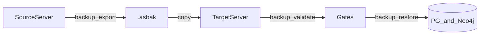

# Project-Scoped Backup and Restore

## Purpose

Move **one** Astloom project's analytical state between servers using a portable
`.asbak` archive. This is not full-platform disaster recovery; it is a scoped migrate
path for memories, core data, code graph, docs-sync, guidance, and related rows.

## Operator flow



| Step | Actor | Action | Outcome |
| --- | --- | --- | --- |
| 1 | Operator | `astloom backup export -o ./p.asbak` on source | Bundle written with checksums |
| 2 | Operator | Copy `.asbak` to target host | File available offline |
| 3 | Operator | `astloom backup validate -i ./p.asbak` | Contract/checksum/schema gates |
| 4 | Operator | `astloom backup dry-run -i ./p.asbak` | Conflict preview without writes |
| 5 | Operator | `astloom backup restore -i ./p.asbak` | Import into empty scope |
| 6 | Operator | Or restore with `--replace --yes` | Wipe target scope then import |

## Commands

```bash
# Export active scope (or pass --tenant/--workspace/--project)
astloom backup export -o ./project.asbak

astloom backup validate -i ./project.asbak
astloom backup dry-run -i ./project.asbak

# Empty target
astloom backup restore -i ./project.asbak

# Non-empty target (destructive)
astloom backup restore -i ./project.asbak --replace --yes

# Optional remap on restore
astloom backup restore -i ./project.asbak \
  --remap-tenant NEW_T --remap-workspace NEW_W --remap-project NEW_P

astloom backup status
```

Optional `--skip-contract` on `validate` / `dry-run` / `restore` skips only the
`contract_version` gate; checksums and schema fingerprint still apply.

## What is included

| Store | Content |
| --- | --- |
| `project_profile` | Scoped documents |
| `identity_access` | Project documents |
| `common_context` | Guidance documents |
| `core_data` | Tasks, decisions, activities, … |
| `memory` | Items, questions, batches, embeddings, embedding id map |
| `code_graph` | PG symbols/edges/embeddings + Neo4j nodes/relationships |
| `docs_sync` | Symbols, documents, anchors, drift, drafts |
| `rule_engine` | Rules and evaluation artifacts |
| `adapter` | Connector **metadata** only (no secrets) |
| `orchestration` | Scoped documents |
| `audit` / `reporting` | Scoped documents |
| `local` | `.astloom/projects/...json` pin (no secrets) |

## What is excluded (v1)

- Broker/outbox replay and adapter delivery/dead-letter streams
- Connector credential material
- Full-server Postgres/Neo4j volume snapshots
- Per-row merge (only empty-target import or full scope replace)

## Gates and failure

| Gate | Behavior |
| --- | --- |
| Checksums | Fail before writes if any file mismatches |
| `contract_version` | Fail unless `--skip-contract` |
| Schema fingerprint | Host must have every table the bundle used |
| Target non-empty | Fail unless `--replace --yes` |
| Insert conflicts | Fail if rows cannot insert after wipe/remap |
| Remap plain PKs | When target scope differs, opaque text ids become `asbak:{tenant}/{workspace}/{project}:{id}` so same-server clone does not collide with source rows; `sym:`/`doc:`/`edge:` ids rewrite the embedded project segment |
| Neo4j | If `ASTLOOM_CODE_GRAPH_STORE=neo4j`, export refuses placeholder password; restore fails if relationships cannot bind; scope wipe deletes nodes in batches |
| Post-restore counts | Fail if imported counts fall short of manifest |

## MCP (agents)

| Tool | Role |
| --- | --- |
| `astloom_backup_status` | Last local job summary under `<ASTLOOM_DATA_ROOT>/backup/` |
| `astloom_backup_dry_run` | Validate a **server-local** `bundle_path`; no large file transfer |

Export/restore remain CLI-only (server / both install roles). Client-only hosts do not
expose `backup` in the thin CLI allowlist.

## Install verification

After `install.sh` / `ensure-venv.sh`, these must succeed on **server** / **both**:

```bash
python -c "import astloom_backup; print(astloom_backup.__name__)"
astloom doctor   # import_astloom_backup: true
astloom backup status
astloom mcp tools | grep astloom_backup
```

Package ships via `pyproject.toml` (`astloom_backup`) with `pip install -e .`.
Usage-profile tools ship with `backend/configs/usage-profiles/programming-cursor-mcp.json`.

## Related Documents

- [Design](../superpowers/specs/2026-08-01-project-backup-restore-design.md)
- [Data retention and DR](./04-data-retention-backup-and-disaster-recovery.md)
- [CLI command reference part 4](../08-software-engineering-architecture/42-astloom-cli-command-reference-part-4.md)
- [Package runbook](../../backend/runbooks/backup-restore/README.md)
- [Storage ownership matrix](../13-technology-stack-and-platform-decisions/13-storage-ownership-matrix.md)
