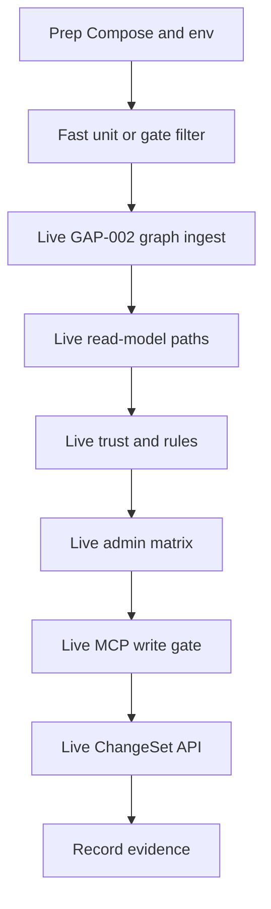

# GAP-002 and GAP-A01–A08 Live Verification Runbook

## Purpose

Define **how to prove** the GAP-002 and GAP-A01–A08 backend closures work against a **real** local stack (Compose Neo4j + Postgres, live HTTP services, MCP gateway). Unit and gate suites are a fast filter only. This runbook is the recurring acceptance checklist for the next validation pass.

**In scope:** Java parser + Spring/Wire DI ingest, architecture governance catalogs + enforcement hooks, ChangeSet collaboration APIs, MCP guidance fail-closed writes.

**Out of scope (deferred by plan):** admin web UI, IDE chrome, diff viewer UX, WorkMilestone planning UI.

## Verification flow



| Step | Actor action | System result | Pass signal |
| --- | --- | --- | --- |
| Prep | Start Neo4j/Postgres; export secrets/ports | Healthy containers | `wait-healthy.sh` exits 0 |
| Filter | Run named unit/gate slices | Deterministic green | pytest exit 0 |
| GAP-002 | Ingest real `.java` / Spring / Wire sources into Neo4j | Symbols + `CALLS` with `provenance=di_injection` | Query returns expected edges |
| A03 | Hit memory explain, generation-context, audit timeline, guidance | Responses carry catalog `read_model_id` | IDs match `read-model-catalog.json` |
| A05 | Evaluate rule with low trust subject | Verdict escalate / block | Rationale cites high-risk floor |
| A07 | Call authorize / register / activate with deny roles | Deny + audit event | HTTP 4xx or domain error; outbox has `admin.authorize` |
| A06 | MCP write with and without guidance env | Soft hint vs hard fail | Fail-closed raises when required |
| A08 | Create ChangeSet → review rollup → approve after `changes_requested` | State machine advances on live API | Final status `approved` |

## Prerequisites

| Requirement | Detail |
| --- | --- |
| Repo root | `/opt/Astloom` (or checkout root) |
| Python | `.venv` with `tree-sitter-java` installed |
| Compose data plane | Neo4j + Postgres from Astloom compose |
| Secrets | Match Compose: `ASTLOOM_NEO4J_PASSWORD`, `ASTLOOM_POSTGRES_PASSWORD` (default lab: `astloom-local-dev-secret`) |
| Ports | Non-default lab ports: Neo4j bolt `32287`, Postgres `32232` (see port-management doc) |
| Service ports | Core data `32110`, memory `32120`, code-graph `32140`, rule-engine `32150`, adapter `32170`, MCP HTTP `32500` unless remapped |

Bring up data plane:

```bash
cd /opt/Astloom
export ASTLOOM_NEO4J_PASSWORD=astloom-local-dev-secret
export ASTLOOM_POSTGRES_PASSWORD=astloom-local-dev-secret
backend/deployments/compose/wait-healthy.sh --timeout 90 astloom-neo4j-1 astloom-postgres-1
```

Start application services with the project’s normal host path (`astloom service start` or equivalent compose app stack). Confirm listeners on the ports above before scenarios.

## Fast filter (not acceptance)

Run before live work. Green here does **not** close live acceptance.

```bash
.venv/bin/python -m pytest \
  tests/backend/packages/test_architecture_governance.py \
  tests/backend/gates/di-composition-verification \
  tests/backend/gates/gap-register-verification \
  tests/backend/services/code-graph-service/test_di_ingest.py \
  tests/backend/services/core-data-service/test_changeset_collaboration.py \
  tests/backend/services/mcp-gateway-service/test_guidance_write_gate.py \
  -q
```

Register/status parity:

```bash
PYTHONPATH=tests/support:backend/packages \
  .venv/bin/python -m pytest tests/backend/gates/gap-register-verification -q
```

## Scenario L0 — Environment sanity

1. TCP connect to Neo4j `32287` and Postgres `32232`.
2. `GET` health (or root) on core-data, memory, code-graph, rule-engine, adapter, MCP gateway.
3. Confirm `ASTLOOM_TENANCY_MODE` unset or `shared_scoped`.

**Pass:** all health checks 2xx/ready; wrong tenancy modes without required env fail fast when resolved via `architecture_governance.resolve_tenancy_mode` in a one-shot Python probe against the live process env.

## Scenario L1 — GAP-002 Java + Spring/Wire (real graph)

**Goal:** prove tree-sitter Java ingest and DI edges land in **Neo4j**, not only InMemoryStore.

1. Create a temporary project tree with:
   - `UsersService.java` + Spring `@Autowired` consumer (and optionally `@Autowired` constructor).
   - `wire.go` containing `wire.Build(NewUsersService, NewOrdersService)`.
2. Ingest via live code-graph path (pick one):
   - HTTP ingest/sync against code-graph service, or
   - `astloom sync` / `samples/e2e-graph-probe/run_probe.py` pattern against Neo4j stores, or
   - marked live pytest under `tests/backend/services/code-graph-service/` when Compose is up.
3. Query Neo4j for symbols from `.java` files and `CALLS` edges with `provenance = 'di_injection'` and `framework` in `{spring, wire}`.

**Pass:**

- At least one Java `CLASS`/`METHOD` symbol from the fixture exists in Neo4j for the test scope.
- At least one Spring DI `CALLS` edge and one Wire DI `CALLS` edge with `provenance=di_injection`.
- Plain Java POJO constructor **without** `@Autowired`/`@Inject` does **not** create a false DI edge.

**Evidence:** Cypher result screenshots or exported JSON; ingest correlation ids; Neo4j database name.

## Scenario L2 — GAP-A01 / A02 catalogs on a live process

1. From a shell with `backend/packages` importable, load catalogs via `architecture_governance` and print `operation_mode` / `timeout_seconds` / `retry_policy` for `code_graph.ingest_file`, `memory.consolidate_memory`, `outbox.relay`.
2. Run DI composition gate against the tree (includes forbidden persistence scan):

```bash
PYTHONPATH=tests/support:backend/packages \
  .venv/bin/python -m pytest tests/backend/gates/di-composition-verification -q
```

**Pass:** modes match `sync-async-boundaries.json`; DI gate all checks `passed`; no forbidden cross-service `postgres_store` imports.

## Scenario L3 — GAP-A03 read models (live HTTP)

Against running services, call:

| Surface | Example | Expected field |
| --- | --- | --- |
| Memory explain | `GET /api/v1/projects/{p}/context-bundles:explain?query=...` | `read_model_id=memory.context_bundle` |
| Code-graph generation context | generation-context API or MCP capability | `read_model_id=code_graph.generation_context` |
| Audit timeline | `GET /api/v1/projects/{p}/audit/timeline?correlation_id=...` | `read_model_id=audit.timeline` |
| Guidance resolve | MCP `astloom_guidance_resolve` or common-context resolve HTTP | bundle `read_model_id=common_context.guidance` |

Also mutate a memory item after building a context bundle and confirm stale detection still fires (memory retrieve → mutate store → verify), with catalog invalidation id `source_memory_version_change`.

**Pass:** every response includes the catalog id; stale path still reports stale-after-build.

## Scenario L4 — GAP-A04 tenancy modes (live env)

1. With default env, resolve mode → `shared_scoped`.
2. Set `ASTLOOM_TENANCY_MODE=db_per_tenant` without `ASTLOOM_TENANT_DATABASE_URL_TEMPLATE` → process/config probe must fail closed.
3. Repeat for `graph_per_tenant` and `deploy_per_customer` missing required env.
4. Under `shared_scoped`, create two tenants’ records via live APIs; confirm cross-tenant list/get cannot see the other tenant’s rows (core-data or memory).

**Pass:** fail-fast errors for incomplete modes; tenant isolation holds on live Postgres.

## Scenario L5 — GAP-A05 agent trust (live rule-engine)

1. Create a sensitive/security rule via rule-engine HTTP.
2. `POST` evaluate with `agent_trust_level=standard` (below elevated floor) and tags `security` / `production`.
3. Confirm final verdict is escalate (require approval) and rationale mentions high-risk floor / `provider_rank`.
4. Re-run with `agent_trust_level=elevated` and observe allow or non-floor path per rule content.
5. Register an adapter connector with invalid `trust_level` → validation error; with valid enum → pending connector.

**Pass:** floor behavior visible on live evaluate; adapter enum enforced.

## Scenario L6 — GAP-A06 MCP guidance gate (live MCP HTTP)

1. Ensure MCP gateway is listening (lab default `32500`).
2. Soft mode: unset `ASTLOOM_GUIDANCE_RESOLVE_REQUIRED`; call durable write capability **without** prior guidance resolve → write succeeds with `guidance_hint`.
3. Fail-closed: set `ASTLOOM_GUIDANCE_RESOLVE_REQUIRED=1` on the gateway process; restart or reload env; write without guidance → hard error mentioning guidance resolve.
4. Call `astloom_guidance_resolve` (or equivalent), then write again → success without fail-closed error.

**Pass:** both soft and fail-closed behaviors observed on the **running** gateway, not only unit doubles.

## Scenario L7 — GAP-A07 admin matrix (live IAM + mutations)

Headers for all calls: `X-Tenant-Id`, `X-Workspace-Id`, `X-Actor-Id`, `Idempotency-Key`.

1. Upsert principal with role `viewer` only.
2. `POST /authorize` with action `adapter.install` → `allowed=false`; outbox/audit contains `admin.authorize`.
3. Upsert principal with `integration_admin`; authorize same action → `allowed=true` + audit event.
4. With `ASTLOOM_ENFORCE_ADMIN_MATRIX=1` (or actor_roles in payload):
   - adapter `register_connector` as viewer → denied;
   - weight profile activate as viewer → denied;
   - project-profile register as viewer → denied.
5. Repeat allow path with correct admin roles.

**Pass:** deny and allow both emit audit; mutation entrypoints refuse without matrix entitlement when enforce/roles present; missing `architecture_governance` under enforce fails closed (no silent bypass).

## Scenario L8 — GAP-A08 ChangeSet collaboration (live core-data)

Against core-data HTTP (`ASTLOOM_CORE_DATA_PORT`, default `32110`):

1. `POST /api/v1/projects/{p}/changesets` with `title` + `artifact_ref` → status `draft`.
2. Transition `open` → `in_review`.
3. Create review thread + review comment with `verdict=request_changes` → ChangeSet becomes `changes_requested`.
4. `POST .../changesets/{id}:approve` as a **different** actor → reaches `approved` (must resume from `changes_requested`).
5. Self-approve as author → conflict/forbidden.
6. Attach discussion-comment targeting the changeset; create work-label.
7. Create with same Idempotency-Key → same record id.
8. Store an `external_fingerprint` (e.g. `github:pr:123`) and confirm SoR id remains the Astloom ChangeSet id.

**Pass:** full state path works on live Postgres-backed core-data; rollup and approve-after-changes work; fingerprint is projection only.

## Evidence pack (required for “CLOSED stays CLOSED”)

Store under `tests/artifacts/gap-live/` (create if missing):

| Artifact | Content |
| --- | --- |
| `env.txt` | Ports, tenancy mode, compose project name, git SHA / dirty flag |
| `l1-neo4j.json` | Cypher results for Java symbols + DI edges |
| `l3-read-models.json` | HTTP bodies showing `read_model_id` |
| `l5-trust.json` | Rule evaluate responses (low vs elevated trust) |
| `l6-mcp.json` | Soft write + fail-closed error + post-guidance write |
| `l7-admin.json` | Authorize allow/deny + mutation denials |
| `l8-changeset.json` | Create/transition/rollup/approve responses |

Do **not** put secrets in evidence files.

## Acceptance

This closure set remains accepted for a release/validation pass only when:

1. Fast filter pytest slices are green.
2. Scenarios **L0–L8** all pass against the live stack.
3. Evidence pack is attached to the validation note / Task.
4. `GAP-002` and `GAP-A01`…`GAP-A08` remain `CLOSED` in `backend/configs/governance/gap-register.json` with matching Markdown statuses.
5. Explicit UI deferrals are still deferred (no accidental scope creep).

If any live scenario fails, treat the gap as **regressed** until root-caused; do not “unit-green” over a live red.

## Related Documents

- `docs/10-gap-analysis/02-architecture-gaps.md`
- `docs/10-gap-analysis/06-phase10-verification-and-acceptance.md`
- `docs/08-software-engineering-architecture/25-live-and-unit-test-strategy.md`
- `docs/07-code-knowledge-graph/33-production-retrieval-live-test-gates.md`
- `docs/08-software-engineering-architecture/04-development-port-management.md`
- `docs/01-core-data-model/08-changeset-review-and-discussion-contracts.md`
