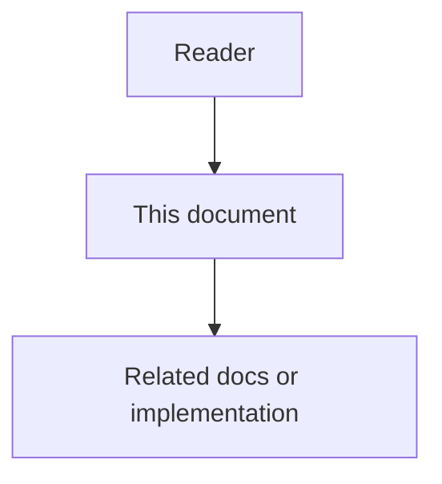

# 01 - Common Context Feature Specification

## Purpose

Users repeatedly provide the same instructions: documentation language, architecture style, port policies, project isolation rules, review expectations, naming conventions, deployment constraints, and domain terminology. Repetition wastes time, increases token usage, causes incon.

## Document flow

| Step | Actor | Action | Outcome |
| --- | --- | --- | --- |
| 1 | Reader | Opens this design document | Understands scope and constraints |
| 2 | Reader | Follows the Mermaid flow | Sees primary component interactions |
| 3 | Reader | Uses Related Documents / linked symbols | Reaches deeper design or implementation |

## Problem

Users repeatedly provide the same instructions: documentation language, architecture style, port policies, project isolation rules, review expectations, naming conventions, deployment constraints, and domain terminology. Repetition wastes time, increases token usage, causes inconsistent behavior, and makes agent quality depend on whether the user remembered to restate the rule.

Astloom needs Common Context: a governed capability that converts stable repeated information into reusable project context.

## Goals

- Reduce repeated user instructions across tasks, agents, tickets, and workflows.
- Keep shared guidance in one governed place instead of scattering it across prompts, scripts, code, and documents.
- Inject only relevant common context based on task, project, workflow, agent type, and token budget.
- Preserve project isolation by default.
- Allow explicit project-group composition for related projects such as frontend and backend.
- Let users approve, edit, pin, suppress, retire, and audit common items through the admin interface.
- Measure impact on repetition, token usage, delivery speed, bug reduction, architecture consistency, and rework.

## Non-Goals

- Not a replacement for memory. Memory stores observations and learned facts; Common Context stores reusable guidance intended for repeated application.
- Not a rule engine. It can reference reusable rules, but policy execution remains owned by rule-engine-service.
- Not global state. Every item must have explicit scope and isolation.
- Not hard-coded prompt text.

## Functional Requirements

1. Detect repeated instructions and propose them as candidate common items.
2. Store common items with scope, type, owner, lifecycle status, version, confidence, source evidence, and audit metadata.
3. Calculate reuse scores from configurable weights.
4. Resolve a context bundle before an agent run starts.
5. Explain why each common item was selected, suppressed, overridden, or rejected.
6. Require human approval for high-impact or cross-project items.
7. Allow explicit authorized task instructions to override common defaults.
8. Prevent unrelated projects from sharing common items.
9. Support approved project groups for selected sharing.
10. Report reduced repetition and estimated token savings.

## Acceptance Criteria

A user should be able to stop repeating a stable rule after approving it as a CommonItem. Future relevant tasks should receive the rule automatically, with a visible explanation and an audit record.
