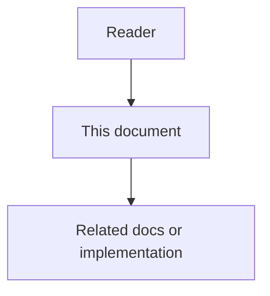

# 02 - Common Context High-Level Design

## Purpose

Common Context is a dedicated domain and service between user intent, project profiles, memory retrieval, rule execution, and agent orchestration.

## Document flow

| Step | Actor | Action | Outcome |
| --- | --- | --- | --- |
| 1 | Reader | Opens this design document | Understands scope and constraints |
| 2 | Reader | Follows the Mermaid flow | Sees primary component interactions |
| 3 | Reader | Uses Related Documents / linked symbols | Reaches deeper design or implementation |

## Architecture Overview

Common Context is a dedicated domain and service between user intent, project profiles, memory retrieval, rule execution, and agent orchestration.

Before an agent run starts, orchestration requests a Common Context Bundle for a specific project, optional project group, workflow type, task type, agent type, user, and token budget. The Common Context Service resolves candidate items, applies isolation rules, scores relevance, detects conflicts, trims to budget, records evidence, and returns an explainable bundle.

## Main Components

- Common Context Domain defines vocabulary, lifecycle, scoring, conflicts, and policies.
- Common Context Service owns item lifecycle, proposal, approval, scoring, bundle resolution, audit, and reporting signals.
- Common Context Package exposes contracts, resolver interfaces, templates, and examples.
- Common Context Profiles store score weights, token budgets, approval thresholds, and feature toggles.
- Admin Web Interface lets users manage common items, proposed items, conflicts, scopes, and audit evidence.
- Reporting Service consumes usage metrics to show repetition reduction and token savings.

## Runtime Flow

1. User submits a task or an agent receives a ticket.
2. Orchestration asks project-profile-service for project scope and active feature profile.
3. Orchestration asks common-context-service for a bundle.
4. The service loads approved items for the exact project and allowed project groups.
5. It adds candidate items from active domain packs and feature profiles.
6. It scores candidates using configured weights.
7. It removes items that violate isolation, access, freshness, or suppression rules.
8. It detects conflicts with explicit task instructions and project overrides.
9. It returns selected items, suppressed items, conflict notes, score breakdowns, and audit ids.
10. Orchestration passes the selected bundle to the agent as structured context.
11. After execution, effectiveness signals update score history.

## Boundary With Memory

Memory answers: what has the system learned or observed?

Common Context answers: which reusable guidance should be applied again without the user repeating it?

Repeated memory signals may propose a common item, but approved common items live in Common Context. This prevents hidden memory from silently becoming operating policy.

## Boundary With Rules

The rule engine evaluates policies and makes decisions. Common Context stores reusable guidance and reusable policy text. A common item may reference a rule-pack id, but execution stays in rule-engine-service.

## Project Isolation

Common items are scoped to a project by default. Sharing across projects requires an explicit project group, an allowed scope binding, and an audit trail. No item may be resolved across unrelated projects even when text similarity is high.
