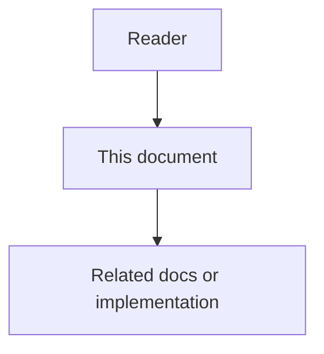

# 03 - Common Context Low-Level Design

## Purpose

A reusable rule, definition, convention, constraint, instruction, or workflow reminder.

## Document flow

| Step | Actor | Action | Outcome |
| --- | --- | --- | --- |
| 1 | Reader | Opens this design document | Understands scope and constraints |
| 2 | Reader | Follows the Mermaid flow | Sees primary component interactions |
| 3 | Reader | Uses Related Documents / linked symbols | Reaches deeper design or implementation |

## Core Entities

### CommonItem

A reusable rule, definition, convention, constraint, instruction, or workflow reminder.

Required fields: id, scope_id, scope_type, item_type, title, body, status, version, owner_id, source_evidence, confidence_score, created_at, updated_at, effective_from, expires_at, tags, and access_policy_id.

### ApplicabilityRule

Defines when a CommonItem may be considered for a task.

Typical fields: workflow_types, task_types, agent_types, domain_tags, repository_patterns, file_patterns, service_names, minimum_similarity, and excluded_contexts.

### ReuseScore

Explains why an item should or should not be included.

Score inputs must be weighted from configuration, not hard-coded: frequency_weight, recency_weight, confidence_weight, user_pin_weight, task_similarity_weight, project_relevance_weight, effectiveness_weight, freshness_penalty, conflict_penalty, and token_cost_penalty.

### ContextBundle

The resolved output passed to orchestration.

Required fields: bundle_id, project_id, workflow_type, task_fingerprint, selected_items, suppressed_items, conflicts, score_breakdowns, token_estimate, and audit_record_id.

## Resolution Algorithm

1. Normalize task metadata into a task fingerprint.
2. Load the project scope and allowed project-group scopes.
3. Fetch approved common items for allowed scopes.
4. Add active domain-pack and feature-profile items.
5. Exclude expired, deprecated, inaccessible, or suppressed items.
6. Evaluate applicability rules.
7. Calculate weighted reuse score for each candidate.
8. Detect conflicts with task-specific instructions and higher-priority project overrides.
9. Sort by priority, score, confidence, and token efficiency.
10. Select items until the common-context budget is reached.
11. Persist the resolution audit record.
12. Return selected bundle and explanation metadata.

## Conflict Rules

Task-specific user instructions have highest priority when explicit, authorized, and safe. Project-specific common items override project-group items. Organization defaults are lowest priority unless marked as mandatory governance policy.

Every conflict must be visible in the admin interface and queryable through audit APIs.

## Storage Requirements

Future storage should support current item state, version history, scope bindings, applicability rules, review records, suppression records, conflict records, bundle resolution audits, and effectiveness counters.

## Token Budget Handling

The resolver must not inject all reusable items. It must estimate token cost and prefer high-impact, high-confidence, task-relevant items. Long items should support summarized variants and references to full documentation.

## Testing Requirements

Unit tests must cover scoring, filtering, conflict resolution, budget trimming, isolation, and deterministic ordering. Live tests must verify resolution against realistic project data and admin-managed profiles.
