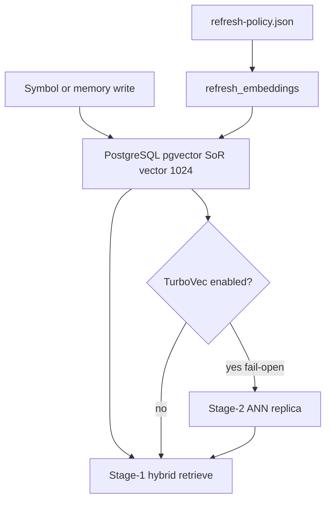

# 14 - Embedding Lifecycle And Refresh

## Purpose

Define when embeddings regenerate, where they are stored, how model changes invalidate
rows, and how optional TurboVec Stage-2 acceleration stays a replica — closing GAP-T03.

## Lifecycle flow

| Step | Actor | Action | Outcome |
| --- | --- | --- | --- |
| 1 | Ingest / memory index | Upserts embedding row with model + dims | SoR current |
| 2 | Retrieve | Stage-1 cosine/HNSW over pgvector | Ranked ids in tenant scope |
| 3 | Optional ANN | Sync replica after SoR write; fail-open | Faster neighbor candidates |
| 4 | Refresh job | Re-embeds on model mismatch / missing / force | Stale rows replaced |

## System of record

| Surface | Table | Vector type | Owner |
| --- | --- | --- | --- |
| Code-graph symbols | `code_graph.symbol_embeddings` | `vector(1024)` | code-graph-service |
| Memory items | `memory.memory_embeddings` | `vector(1024)` | memory-service |

TurboVec (or any in-process ANN) is **never** SoR. Durable truth stays in PostgreSQL + pgvector.

Machine policy: `backend/configs/embeddings/refresh-policy.json`.

Code-graph Settings resolve the pgvector URL as `ASTLOOM_CODE_GRAPH_DATABASE_URL`, else
`ASTLOOM_DATABASE_URL`. Without either, the embedding index is not constructed; refresh
reports `embedding_index_unavailable` and hybrid retrieval may surface `semantic_error`
while lexical channels still work.

## Regenerate triggers

1. Configured embedding model differs from stored `model` column.
2. Missing embedding row for a searchable / active entity.
3. Symbol body or living docs changed on ingest (existing Stage-1 path).
4. Operator force refresh (`refresh_embeddings(..., force=True)`).
5. Orphan cleanup after delete (drop embedding rows with no live symbol/memory).

Default policy sets `skip_when_model_unchanged: true` and `model_change_policy: scoped_reembed`
(re-embed only the scoped project, not the whole cluster).

## Operator sync modes (code-graph)

After ingest, code-graph calls `refresh_embeddings_after_ingest`:

| Mode | How operators select it | Behavior |
| --- | --- | --- |
| `touched` | Everyday `astloom sync` (default) | Refresh embeddings for files visited this run; noop drains a capped backlog |
| `full` | `astloom sync heal`, MCP `embedding_refresh_mode=full`, or `ASTLOOM_EMBEDDING_REFRESH_FULL=1` | Whole-scope missing/mismatch + orphan cleanup, uncapped |

Normative operator runbook: [`../07-code-knowledge-graph/77-sync-embedding-heal-operator-runbook.md`](../07-code-knowledge-graph/77-sync-embedding-heal-operator-runbook.md).

## Refresh job states

Jobs report one of `pending` → `running` → `complete` | `failed` (see `states` in
`refresh-policy.json`). `RefreshReport.state` is the operator-visible status; dry-run jobs
still end in `complete` but never write SoR rows. Failures capture `error` and must not leave
a silent incomplete run.

Tenant isolation is mandatory: every refresh binds `tenant_id` / `workspace_id` /
`project_id`; incomplete scope fails closed (`state=failed`). Cross-tenant refresh is
forbidden.

## Stage-1 and Stage-2

- **Stage-1:** kind-filtered pgvector search (code-graph) or cosine over `memory_embeddings`
  (memory). Tenant / workspace / project isolation is mandatory.
- **Stage-2:** optional TurboVec rerank via `vector_index` after SoR hits; failures must not
  block Stage-1 results (`fail_open: true` in policy).

## Related Documents

| Document | Role |
| --- | --- |
| `08-turbovec-ann-acceleration-integration.md` | ANN accelerator ADR |
| `11-turbovec-for-rag.md` | RAG usage notes |
| `13-storage-ownership-matrix.md` | Store ownership |
| `../10-gap-analysis/03-technical-implementation-gaps.md` | GAP-T03 register |
| `../07-code-knowledge-graph/77-sync-embedding-heal-operator-runbook.md` | Sync vs sync heal operator contract |
