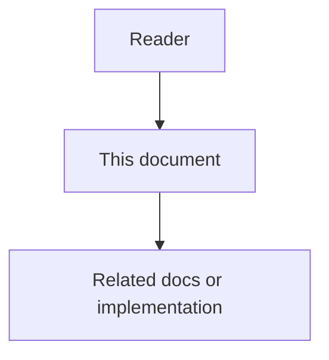

# 01 - Agent Workspace Guidance Feature Specification

## Purpose

This document specifies the product behavior of Agent Workspace Guidance for engineers, architects, and product designers. It owns requirements and acceptance criteria. Runtime topology lives in the high-level design; artifact algorithms and export mapping live in the low-level design; wire contracts live in the contracts document.

## Document flow

## Professional Audience

Readers are expected to implement or review MCP tools, Common Context typed items, admin workflows, and IDE connector onboarding without beginner tutorials.

## Problem Statement

Coding agents such as Cursor and Claude Code–style tools improve when the workspace declares:

- an entry document (`AGENTS.md`) that points to laws and high-signal skills;
- always-on rules (for example `.mdc` / always-apply policies);
- on-demand skills (`SKILL.md` with clear when/how instructions).

Today Astloom connects those agents primarily as MCP clients with memory, graph, and docs tools. It does **not** present a governed, project-scoped Skills / Rules / AGENTS surface at connect time. Guidance either lives only in the developer’s local IDE tree (invisible to Astloom governance) or must be restated in chat. Quality then depends on whether the human remembered the conventions.

## Goals

- Give every connected coding agent a first-class, project-scoped guidance bundle before substantive coding work.
- Mirror the industry artifact shapes agents already understand: AGENTS entry, always-on rules, on-demand skills.
- Keep Common Context as the source of truth for scope, approval, versioning, and audit.
- Deliver the authoritative bundle over MCP (Usage Profile tool surface).
- Optionally materialize the same guidance into IDE-native files for clients that only read the filesystem.
- Make selection explainable: why each rule or skill was included, suppressed, or deferred.
- Preserve tenant / workspace / project / user isolation and precedence (task override > user > project > org).
- Ship a platform seed pack of always-on rules and skills that instruct coding agents to route Astloom-capable work through MCP (see [`06-mcp-first-agent-skills-and-rules.md`](06-mcp-first-agent-skills-and-rules.md)).
- Include dead-code cleanup in that seed pack: always-on same-change orphan removal plus on-demand `astloom-remove-dead-code` (scored unused-candidates with `score`/`evidence`/`finding_kind`; MCP default `task_neighborhood`), aligned with the graph cleanup loop ([`../07-code-knowledge-graph/36-dead-code-candidates-and-cleanup-loop.md`](../07-code-knowledge-graph/36-dead-code-candidates-and-cleanup-loop.md)).
## Non-Goals

- Not a replacement for the platform rule engine; policy *execution* stays in rule-engine-service.
- Not a replacement for memory or code-metadata context packs; those remain separate retrieval surfaces.
- Not IDE-only pack drafting for developing the Astloom repo (`docs/agents/`, `.cursor/` in this repository).
- Not hard-coded global system prompts baked into every adapter.
- Not automatic silent overwrite of unapproved local filesystem edits during materialize.
- Not implementing Claude Code or Cursor proprietary internals; only the portable artifact *shape* and Astloom delivery.

## Actors And Permissions

| Actor | Job | Permission notes |
| --- | --- | --- |
| Project admin | Approve, edit, retire project guidance; trigger export | Project-scoped write + approve |
| Domain / platform operator | Publish org-default guidance templates | `scope_kind=org`; audit required |
| Developer | Maintain personal user-profile skills/rules; consume via IDE agent | `scope_kind=user` (skills + non-mandatory rules only); read resolve |
| Coding agent (MCP client) | Resolve bundle, list skills, fetch skill bodies | Tool calls under active Usage Profile |
| Reviewer | Audit what guidance applied to a change | Read audit / bundle evidence |

## Product Workflow

### Authoring

1. Operator creates or imports guidance into Common Context at the appropriate layer: `org` (workspace defaults), `project`, or `user` (personal pack).
2. Org and project layers may author `agents_entry`, `always_rule`, and `skill`. User layer may author `skill` and non-mandatory `always_rule` only.
3. High-impact or cross-project items require human approval before they become resolvable.
4. Admin UI shows lifecycle status, version, layer, applicability, and last resolve evidence.

### Connect-time / pre-run consume

1. Coding agent connects through Usage Profile MCP (or orchestration starts a coding run).
2. Agent (or gateway bootstrap) calls resolve guidance and receives the bundle: entry body, applicable always-on rules, skill catalog (descriptors only by default).
3. Agent follows the entry and always-on rules while planning (including `mcp-first-astloom` when seeded).
4. When a skill applies (for example `astloom-memory` or `astloom-code-graph`), agent fetches the skill body on demand.
5. Agent issues the matching Astloom MCP tool calls for in-scope capabilities, then proceeds with local edits as needed.

### Optional materialize

1. Operator requests export for a target layout (Cursor-compatible or Claude-compatible paths).
2. System writes or updates files only under an explicit policy (create, update-if-managed, or conflict report).
3. Drift between Common Context and disk is detectable and reportable.

## Interaction State Model

| State | Meaning | UI / agent signal |
| --- | --- | --- |
| Empty | No approved guidance for project | Prompt to seed from template or import |
| Draft | Items exist but unapproved | Resolve excludes drafts by default |
| Ready | Approved entry and/or rules and/or skills | Resolve returns non-empty bundle |
| Partial | Entry missing but rules/skills present | Warning in bundle metadata |
| Conflict | Task override or disk export conflict | Conflict list + non-overwrite |
| Degraded | Common Context unavailable | Fail closed or cached last-good per profile policy |
| Retired | Items deprecated | Excluded from resolve; visible in history |

## Information Architecture Impact

- Admin: new Guidance section under project Common Context (typed tabs: Entry, Rules, Skills).
- MCP: new tools under programming Usage Profiles (see contracts doc).
- Operator docs: connect checklist includes “resolve guidance before coding”.
- Clear separation in product copy between “platform guidance” and “local IDE files for this repo”.

## System Behavior

- Resolve must be deterministic given the same project scope, task fingerprint, profile, and item versions.
- Always-on rules are included when applicable and within token budget; skills appear as catalog entries until fetched.
- Exactly one active `agents_entry` in the merged bundle (project wins; org supplies fallback when project entry is absent).
- Skill bodies are not dumped into every session by default.
- Precedence: task overrides > user profile > project > org defaults. Same slug/name: higher layer replaces lower. Mandatory org/project items that a higher layer would replace with a different body produce a conflict and the mandatory item is kept.

## Owning Modules

| Concern | Owner |
| --- | --- |
| Item lifecycle, approval, resolve core | `common-context-service` |
| Typed guidance projection / export mapping | Common Context domain + AWG projection package (design) |
| MCP tool advertisement and dispatch | `mcp-gateway-service` |
| Usage Profile tool allow-list | `usage_profile` catalog + `project-profile-service` |
| Admin surfaces | Admin web interface (Common Context / Guidance) |

## Public Contracts

Normative shapes: [`04-data-contracts-and-events.md`](04-data-contracts-and-events.md). Minimum MCP surface:

- `astloom_guidance_resolve`
- `astloom_guidance_list_skills`
- `astloom_guidance_get_skill`

## Data Model Impact

CommonItem gains or uses guidance kinds: `agents_entry`, `always_rule`, `skill`. Skill metadata includes `name`, `description`, `when_to_use`, and body. Export records track managed paths and content hashes. Bundle audits reference selected item versions.

## Event Flow

Resolve emits `AgentWorkspaceGuidanceBundleResolved`. Approve/update of typed items reuse Common Context item events with guidance kind in payload. Export emits `AgentWorkspaceGuidanceExported` with conflict summaries when present.

## Configuration Impact

- Usage Profile MCP tool lists must opt in to guidance tools.
- Feature profile flags: enable guidance resolve, enable materialize, allow org fallback entry.
- Token budgets for always-on rules vs skill catalog vs skill body fetch.

## Security And Privacy Constraints

- Guidance is project-scoped; cross-project resolve requires approved project-group binding.
- Treat guidance bodies as prompt-influencing content: approval gates for high-impact text; audit who changed what.
- MCP tools inherit tenant/workspace/project env scope; refuse out-of-scope ids.
- Materialize must not write outside configured workspace roots.

## Failure Modes And Recovery

| Failure | Behavior |
| --- | --- |
| No approved guidance | Empty bundle with explicit empty reason; agent may continue with degraded quality |
| Common Context down | Profile policy: fail closed (recommended for governed projects) or last-good cache with staleness flag |
| Skill id unknown | Tool error; do not invent body |
| Export path conflict | Report conflict; do not overwrite unmanaged local edits |
| Budget exceeded | Trim lowest-score always-on rules; keep entry if present; skills stay catalog-only |

## Observability And Diagnostics

Emit resolve latency, selected counts by kind, token estimates, suppressions, conflicts, skill fetch rates, and export conflict counts. Correlate with `bundle_id` and `audit_record_id`.

## Testing And Verification

- Unit: kind validation, single active entry invariant, precedence, budget trim, skill catalog vs body.
- Contract: MCP tool schemas and Usage Profile allow-list.
- Live: activate `programming-cursor-mcp` (or successor), resolve non-empty bundle for a seeded project, fetch one skill, export dry-run reports conflicts correctly.

## Rollout And Migration Notes

Ship docs and contracts first. Implementation adds kinds to Common Context, then MCP tools, then optional exporter. Existing free-text CommonItems remain valid; operators may migrate high-signal items into typed kinds without deleting history.

## Product Metrics

- Share of coding sessions that call resolve before first write.
- Guidance coverage (% projects with approved entry).
- Skill fetch rate and post-skill task success / rework.
- Export drift rate and conflict rate.
- Estimated tokens saved vs restating conventions in chat.

## Engineering Acceptance Criteria

- Typed kinds are validated and resolvable through Common Context APIs.
- MCP tools are gated by Usage Profile and scoped to project.
- Bundle response includes explanation metadata for inclusions and suppressions.
- Materialize never silently overwrites unmanaged files.
- Automated tests cover precedence and empty/partial/degraded states.

## Product Acceptance Criteria

- A project admin can publish an AGENTS entry, at least one always-on rule, and one skill without leaving Astloom.
- A Cursor (or equivalent) agent connected via MCP can resolve that guidance and follow it before coding.
- An operator can optionally export the same guidance to IDE-native paths and see conflicts instead of silent clobber.
- Developers can explain, from audit UI, which guidance applied to a session.
- Seeded MCP-first rule/skills instruct the agent to call Astloom MCP tools for memory, graph, docs-sync, durable writes, tasks, guidance bootstrap, and dead-code cleanup (normative catalog in [`06-mcp-first-agent-skills-and-rules.md`](06-mcp-first-agent-skills-and-rules.md)).
- Connected coding agents are instructed to remove proven-dead predecessors in the same change after replace/retire (prefer `safe_to_delete` with `score ≥ 0.8`); Astloom does not delete repository files.
## Open Gaps

Tracked in [`05-risks-challenges-and-acceptance.md`](05-risks-challenges-and-acceptance.md). Design closes the documentation side of GAP-A06 for connect-time context injection shape; IDE plugin UX details remain follow-on.
