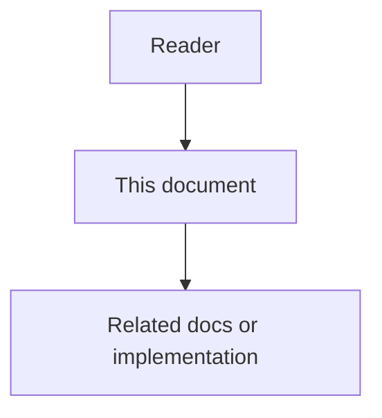

# 02 - Agent Workspace Guidance High-Level Design

## Purpose

This document defines the system-level architecture for Agent Workspace Guidance: how connect-time resolve, MCP exposure, and optional filesystem export fit into Astloom. Algorithms and field-level models live in the low-level design.

## Document flow



| Step | Actor | Action | Outcome |
| --- | --- | --- | --- |
| 1 | Reader | Opens this design document | Understands scope and constraints |
| 2 | Reader | Follows the Mermaid flow | Sees primary component interactions |
| 3 | Reader | Uses Related Documents / linked symbols | Reaches deeper design or implementation |


## Architecture Overview

Agent Workspace Guidance is a **projection and delivery layer** over Common Context, not a second store.

```text
Common Context SoT (typed items)
        |
        v
 Guidance Resolver (kind filters + Common Context bundle pipeline)
        |
        +---> MCP Gateway tools (authoritative session path)
        |
        +---> Optional Exporter (IDE-native files)
```

Coding agents obtain the authoritative view through MCP. Filesystem export exists so tools that only read `AGENTS.md` / rules / `SKILL.md` trees can still operate, under explicit conflict policy.

Platform-seeded MCP-first rules and skills ([`06-mcp-first-agent-skills-and-rules.md`](06-mcp-first-agent-skills-and-rules.md)) are part of the same delivery path: they teach the agent *which* MCP tools to call for each Astloom capability after resolve.

## Main Components

| Component | Responsibility |
| --- | --- |
| Common Context Service | Persist, approve, version, score, and audit typed guidance items |
| Guidance projection | Map CommonItems of kinds `agents_entry` / `always_rule` / `skill` into bundle DTOs and export layouts |
| MCP gateway | Advertise and dispatch resolve / list / get-skill tools when Usage Profile allows |
| Project profile service | Activate Usage Profile; export MCP connection env including project scope |
| Admin web | Authoring and audit UX for typed guidance |
| Exporter (optional worker/API) | Materialize managed files; detect drift and conflicts |

## Guidance Layers

| Layer (`scope_kind`) | Storage | Authors | Contents |
| --- | --- | --- | --- |
| `org` | Workspace defaults (`project_id` sentinel `__org__`) | Domain / platform operator | Entry, rules, skills (templates) |
| `project` | Real project id | Project admin | Entry, rules, skills |
| `user` | Workspace-personal (`project_id` sentinel `__user__:{user_id}`) | Developer (own `user_id`) | Skills + non-mandatory rules only |

Resolve loads org + project + (when actor known) user buckets, then merges by precedence. Each included descriptor carries a `layer` field for explainability. Bundle metadata includes `layers_considered` and optional `user_id`.

## Runtime Flow Connect Path

1. Operator activates a Usage Profile that includes guidance MCP tools on the project.
2. IDE starts `mcp-gateway-service` with tenant / workspace / project env.
3. On session start (or before first write), the agent calls `astloom_guidance_resolve`.
4. Gateway maps the call to Common Context resolve with guidance kind filters, coding-agent applicability, and actor `user_id` for the user layer.
5. Resolver merges org → project → user layers and returns `AgentWorkspaceGuidanceBundle`: entry, always-on rules, skill catalog, suppressions, conflicts, token estimate, audit id.
6. Agent applies entry + rules (including `mcp-first-astloom` when seeded); later calls `astloom_guidance_get_skill` when a catalog skill matches (merged catalog).
7. Agent routes in-scope work through the matching MCP tools (memory, graph, docs, write, tasks) under the same scope, then performs local edits as needed.

## Runtime Flow Materialize Path

1. Operator requests export for a layout profile (`cursor`, `claude_compatible`, or `generic_agents_md`).
2. Exporter loads approved typed items for the project.
3. Exporter computes target paths and content hashes.
4. For each path: create if missing; update if previously managed and hash matches last export or force flag; otherwise record conflict and skip.
5. Emit export audit event with written / skipped / conflict lists.

## Boundary With Common Context

Common Context answers: which reusable guidance items exist, are approved, and score into a general context bundle.

Agent Workspace Guidance answers: which of those items are **coding-agent workspace artifacts**, how they are shaped for AGENTS / rules / skills, and how they are delivered on MCP connect or disk export.

General Common Context resolve may still run for non-coding workflows. Guidance resolve is a specialized resolve request (kinds + coding agent type + skill catalog mode).

## Boundary With Rule Engine

Always-on rules in this phase are **prompt / agent behavior guidance**, not executable platform policies. If a guidance rule references a rule-pack id, execution remains in rule-engine-service.

## Boundary With Context Packs

Code-metadata context packs describe *where to look in the codebase*. Workspace guidance describes *how the agent must behave* (language laws, skill procedures, always-on constraints). Agents should load guidance first, then request context packs.

## Boundary With IDE Repo Docs

`docs/agents/` and this repository’s `.cursor/` trees configure agents working **on Astloom itself**. They are not the customer-facing product store and must not be confused with project guidance managed in Common Context.

## Ownership Matrix

| Concern | Owner service / package |
| --- | --- |
| Item CRUD and approval | `common-context-service` |
| Resolve algorithm inputs/weights | Common Context profiles |
| Bundle DTO for guidance | `common-context` contracts + AWG projection |
| MCP tool schemas and handlers | `mcp-gateway-service` |
| Tool allow-list | Usage Profile catalog |
| Filesystem export | Dedicated exporter API/worker (design); may start as service method on common-context |
| Connection materialization | `project-profile-service` (unchanged MCP fragment; tools list gains guidance entries) |

## Integration With Usage Profiles

Profiles such as `programming-cursor-mcp` should list guidance tools when the feature profile enables them. Disabled features omit tools from `tools/list`. Effective profile resolution does not embed rule bodies into the JSON catalog; bodies come from resolve/get-skill at runtime.

## Quality Attributes

| Attribute | Requirement |
| --- | --- |
| Isolation | Resolve never crosses projects without project-group binding |
| Explainability | Every selected/suppressed item has a reason code |
| Budget | Always-on injection stays within configured token budget |
| Safety | Fail closed for governed projects when SoT is unavailable, unless profile opts into stale cache |
| Drift control | Export is explicit and conflict-aware |
| Observability | Bundle and export audits are queryable |

## Related Documents

- Feature requirements: [`01-feature-specification.md`](01-feature-specification.md)
- Algorithms and layouts: [`03-low-level-design.md`](03-low-level-design.md)
- Contracts: [`04-data-contracts-and-events.md`](04-data-contracts-and-events.md)
- Common Context HLD: [`../12-common-context-reuse/02-high-level-design.md`](../12-common-context-reuse/02-high-level-design.md)
- Usage Profile MCP: [`../08-software-engineering-architecture/35-usage-profile-and-cursor-mcp-onboarding.md`](../08-software-engineering-architecture/35-usage-profile-and-cursor-mcp-onboarding.md)
