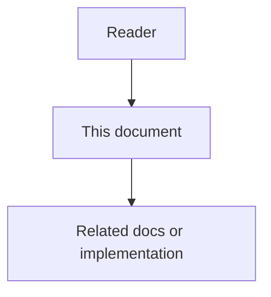

# 03 - Agent Workspace Guidance Low-Level Design

## Purpose

This document defines the typed artifact model, resolve pipeline specialization, precedence, token budgets, and filesystem export layouts for Agent Workspace Guidance.

## Document flow



## Typed Guidance Kinds

All kinds are stored as CommonItems with `item_type` (or equivalent discriminant) set to one of the following.

### agents_entry

Project entry document analogous to `AGENTS.md`.

| Field | Requirement |
| --- | --- |
| `title` | Short label (for example `Agent entry`) |
| `body` | Markdown entry: laws, reading order, high-signal skill pointers |
| `status` | Only `approved` items resolve |
| Invariant | At most one **active approved** `agents_entry` per project scope |

### always_rule

Always-on behavioral rule analogous to Cursor `.mdc` with `alwaysApply` (or equivalent).

| Field | Requirement |
| --- | --- |
| `title` | Stable rule name |
| `body` | Rule markdown |
| `applicability` | Optional globs / agent types / workflow types |
| `priority` | Integer; higher wins within same scope when trimming |
| `mandatory` | If true, task override cannot silently drop without conflict record |

### skill

On-demand procedure analogous to `SKILL.md`.

| Field | Requirement |
| --- | --- |
| `name` | Stable slug (unique per project scope) |
| `description` | One-line when-to-use summary for catalog |
| `body` | Full skill markdown (when / how / do-not) |
| `when_to_use` | Structured triggers (keywords, task types, globs) optional |
| Catalog mode | Resolve returns descriptor only; body via get-skill |

## Example Bodies

### Sample agents_entry body

```markdown
## Agent entry
**Law:** reply language and docs standards as linked skills/rules.

## High-signal skills

| Skill | Use when |
| --- | --- |
| `persian-chat-reply` | User writes Persian |
| `api-contract-check` | Changing public APIs |
```

### Sample always_rule body

```markdown
## Reply language law
- Persian chat → Persian reply.
- Committed docs and code identifiers stay English.
```

### Sample skill body

```markdown
---
name: api-contract-check
description: Validate public API changes against naming and DTO standards.
---

## API contract check
## When

- Editing OpenAPI, DTOs, or public REST paths.

## How

1. Read API naming standard docs.
2. Diff request/response schemas.
3. Refuse undocumented breaking changes.
```

## Scope Kind And Storage Keys

| `scope_kind` | Stored `project_id` | Extra fields |
| --- | --- | --- |
| `project` | Real project id | `scope_kind=project` (default when omitted — backward compatible) |
| `org` | `__org__` | `scope_kind=org` |
| `user` | `__user__:{user_id}` | `scope_kind=user`, `user_id` required |

User authoring rejects `agents_entry` and rejects `mandatory=true` on rules.

## Resolve Pipeline

Guidance resolve reuses the Common Context resolution algorithm with these specializations:

1. Normalize task / session metadata (agent type = coding IDE or autonomous coder) and optional `user_id` (actor).
2. Load approved items for **org**, **project**, and (if `user_id`) **user** buckets in the same tenant/workspace.
3. Filter to kinds `agents_entry`, `always_rule`, `skill` (plus optional non-typed common items only if profile `include_general_common_context` is true — default **false** for pure guidance resolve).
4. Merge layers (see Precedence). Select at most one `agents_entry` (project wins over org; user never supplies entry).
5. Evaluate applicability for merged `always_rule` set and include until always-on budget is exhausted (sort by mandatory, priority, reuse score, token efficiency).
6. Build **skill catalog** from merged skills (name, description, when_to_use, id, version, `layer`) without bodies, until catalog budget is exhausted.
7. Apply precedence against explicit task overrides; record conflicts (including mandatory vs higher-layer body clash).
8. Persist audit; return bundle with `layers_considered` and optional `user_id`.

### Precedence

1. Explicit authorized task instructions (highest).
2. User-profile guidance (`scope_kind=user`).
3. Project-scoped guidance items.
4. Organization default templates (lowest).

Same rule `slug` or skill `name`: higher layer replaces lower. If the lower item is `mandatory` and the higher body differs, keep the mandatory item and append a `GuidanceConflict` (`reason_code=mandatory_override_blocked`).

Task overrides (request field `task_overrides`) may suppress non-mandatory rule slugs or skill names after layer merge. Suppressing a mandatory rule records `task_override_blocked` and keeps the rule.

Project-group shared guidance remains deferred.

## Token Budgets

| Budget slice | Default intent |
| --- | --- |
| `entry_budget` | Fit full entry or summarized variant |
| `always_rules_budget` | Cap always-on injection |
| `skill_catalog_budget` | Descriptors only |
| `skill_body_budget` | Per get-skill call |

Long rule/skill bodies should support a `summary_body` field for budget trimming while keeping full text fetchable.

## Get Skill Behavior

1. Validate skill id belongs to resolved project scope and is approved.
2. Re-check applicability optional (profile flag).
3. Return body + version + hash.
4. Record `SkillFetched` effectiveness signal linked to `bundle_id` when provided.

## Export Layout Mapping

Layout profiles map typed items to paths under a configured workspace root. Profile data lives in `backend/configs/guidance-export/layouts.json` and is loaded by `layout_profiles.get_layout_profile` — Claude aliases are **not** hard-coded in export helpers.

### Layout `cursor`

| Kind | Path pattern |
| --- | --- |
| `agents_entry` | `AGENTS.md` |
| `always_rule` | `.cursor/rules/<slug>.mdc` (YAML always-apply frontmatter) |
| `skill` | `.cursor/skills/<name>/SKILL.md` |

### Layout `claude_compatible`

| Kind | Path pattern (default profile) |
| --- | --- |
| `agents_entry` | `AGENTS.md` and `CLAUDE.md` (dual write) |
| `always_rule` | `.claude/rules/<slug>.md` (no Cursor `.mdc` frontmatter) |
| `skill` | `.claude/skills/<name>/SKILL.md` |

Exact Claude path aliases remain layout-profile configuration. The portable contract is the typed Common Context model plus MCP resolve.

### Layout `generic_agents_md`

Writes `AGENTS.md` only (rules/skills omitted from filesystem export). Clients that need a catalog should resolve over MCP or embed an index in the entry body via profile flag `embed_catalog_in_agents_entry`.

## Materialize Conflict Rules

| Disk state | Action |
| --- | --- |
| Missing | Write managed file; record hash |
| Exists, managed, hash matches last export | Rewrite from SoT |
| Exists, managed, local hash differs | Conflict unless `force_overwrite_managed=true` |
| Exists, unmanaged (no export record) | Conflict; never silent overwrite |
| SoT item retired | Delete only if managed and profile `delete_retired_exports=true`; else leave and report |

## Testing Requirements

- Invariant: two approved `agents_entry` in one project → resolve error or deterministic winner with conflict (prefer reject-on-create).
- Budget trim drops lowest priority non-mandatory rules first.
- Skill catalog never includes raw bodies.
- Export dry-run returns the same conflict set as apply without writes.
- Precedence cases covered by unit tests with fixed fingerprints.
