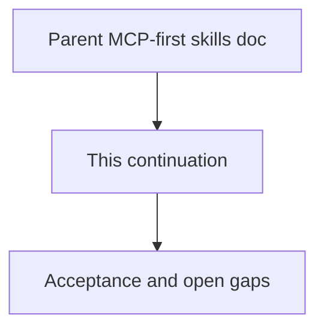

# 06 - MCP-First Agent Skills And Rules (Continued)

## Purpose

Continuation of `docs/15-agent-workspace-guidance/06-mcp-first-agent-skills-and-rules.md` — remaining sections after the soft size budget.

## Document flow



| Step | Actor | Action | Outcome |
| --- | --- | --- | --- |
| 1 | Reader | Opens this continuation | Sees remaining workflow and acceptance content |
| 2 | Reader | Follows Related Documents | Returns to the parent skill/rule specification |

## Product Workflow For Coding Agents

```text
MCP connect
  → astloom-session-bootstrap skill (ping, profile, guidance_resolve)
  → apply always_rule mcp-first-astloom
  → pick capability skill (memory | code-graph | remove-dead-code | remove-stale-docs | documentation-authoring | docs-sync | durable-write | create-task)
  → for documentation questions / product Markdown: astloom_docs_authoring_standards first
  → call matching MCP tool(s)
  → then local code/docs edits as needed (proven dead-code deletes; proven stale-doc remediations)
```

## Skill body: `astloom-remove-stale-docs`

```markdown
---
name: astloom-remove-stale-docs
description: Prove and remediate orphaned, ghost-linked, hash-stale, wiki-orphan, or duplicate-authority documentation after code or docs changes.
---

## Astloom remove stale docs
## When

- After replace/retire of code that had exclusive human docs.
- After material doc edits, drift findings, or linking-gap quality-audit rows.
- Quality-audit category `docs.stale_cleanup_hint` fires after sync inventory.
- Rows with `finding_kind` in `wiki_orphan` / `duplicate_authority` appear.

## How

1. Call `astloom_docs_stale_candidates` (default `scope_mode=task_neighborhood`). For discovery use `project_scan` with `path_prefix` and `min_confidence` (destructive act: `0.8`).
2. Prefer `safe_to_update` and `safe_to_unlink` over `safe_to_delete`. Act only when score ≥ 0.8 and blockers empty. `wiki_orphan` and `duplicate_authority` never auto-delete — add anchors / declare `related_docs` or open a Task.
3. Prove with catalog lanes, `rg` on `doc_id` / path citations, and Related Documents. Never invent `DOCUMENTED_BY`.
4. Remediations: refresh anchors/body, fix `linked_symbols`, mark `historical` + `superseded_by`, split duplicate SoT, or delete true orphans — in the **same** change when possible.
5. Skip uncertain / normative-current (open a Task if needed). Graph + docs registry are SoT — **not** Memory.
6. Verify with `astloom docs-standards` / quality-audit on touched paths.
7. Record Activity/WorkLog using `kpi_hints`: `stale_docs_candidates_surfaced`, `stale_docs_candidates_resolved`, `stale_docs_candidates_skipped_uncertain`.

## Do not

- Ask Astloom to delete Markdown; Astloom only surfaces candidates and guidance.
- Treat Memory as a durable stale-doc queue.
- Delete normative `lifecycle_lane: current` standards without human Task.
- Trust triage alone over evidence.
```

## Interaction With Usage Profiles

- `programming-cursor-mcp` (and successors) **should** advertise the tools referenced above as they are implemented.
- When guidance MCP tools are not yet implemented, seed skills still document the intended names; session bootstrap degrades to ping + effective profile until guidance tools ship.
- Adding a new Astloom MCP capability requires: tool catalog entry, skill (or always-on update), agents_entry row, and contract tests.
- `astloom_code_graph_unused_candidates` is normative in [`../07-code-knowledge-graph/36-dead-code-candidates-and-cleanup-loop.md`](../07-code-knowledge-graph/36-dead-code-candidates-and-cleanup-loop.md) and is advertised on `programming-cursor-mcp` (scored candidates with `score`/`evidence`/`finding_kind`; default `task_neighborhood` with anchors; optional `project_scan`, `disk_search`, `coverage_hits`, `flag_states`, `triage`).
- `astloom_docs_stale_candidates` is normative in [`../07-code-knowledge-graph/78-stale-documentation-candidates-and-cleanup-loop.md`](../07-code-knowledge-graph/78-stale-documentation-candidates-and-cleanup-loop.md) (sister loop; prefer update/unlink over delete).

## Acceptance Criteria

- Seed pack defines `mcp-first-astloom` (including same-change dead-code and stale-docs cleanup, module-contract/README map clauses, and **fix-on-read** for nonconforming product docs + hard-module headers) plus the skills in the matrix (including `astloom-remove-stale-docs`).
- Exported Cursor layout yields always-apply rule + skill folders an agent can load.
- Feature/product docs state that coding agents must route in-scope work through MCP per this document.
- New MCP tools cannot ship in a programming profile without an owning skill or an explicit always-on clause update.
- Dead-code cleanup skill instructs agents to prove before delete and never asks Astloom to mutate the repository.
- Stale-docs cleanup skill instructs agents to prefer update/unlink, prove before delete, and never asks Astloom to mutate the repository.
- Connect / client wire materializes the MCP-first seed into the project workspace (conflict-safe) so always-apply rules exist before the first `guidance_resolve`.
- Store upgrade (`ensure_mcp_first_seed`) is not add-only: it refreshes outdated pack bodies, stamps `seed_pack_version`, and suppresses pack skills retired from the catalog so MCP resolve does not serve obsolete text.
- Disk rematerialize on connect refreshes managed pack files when content advances and deletes retired managed `astloom-*` skill paths (conflict-safe; unmanaged locals stay).

## Open Gaps

| Gap | Notes |
| --- | --- |
| Hard block of writes before resolve | Soft only: always-on rule + `guidance_hint` on durable writes when resolve not yet called in-process |
| Non-Cursor agents | Same skill/rule bodies; layout profile maps paths (`claude_compatible`, `generic_agents_md`) |
| Unused-candidate Neo4j-native query | v1 uses store `list_symbols`/`list_edges` with reachability scoring; optional Cypher inbound-degree optimization later |


## Related Documents

- Parent document: `docs/15-agent-workspace-guidance/06-mcp-first-agent-skills-and-rules.md`
- `docs/07-code-knowledge-graph/36-dead-code-candidates-and-cleanup-loop.md`
- `docs/07-code-knowledge-graph/78-stale-documentation-candidates-and-cleanup-loop.md`
