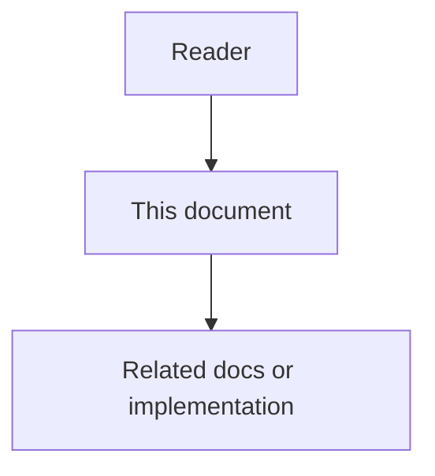

# 06 - MCP-First Agent Skills And Rules

## Purpose

This document specifies the **platform-seeded** always-on rule and on-demand skills that coding agents (Cursor, Claude Code–style clients, and other MCP clients) must follow so that work Astloom can perform is requested **through MCP** against Astloom—not reinvented with ad-hoc local scripts, unmanaged chat-only notes, or bypass of governed stores.

These artifacts are first-class `always_rule` / `skill` / `agents_entry` content under Agent Workspace Guidance. They ship as a default seed pack for Usage Profiles such as `programming-cursor-mcp` and may be exported to IDE-native paths.

## Document flow



| Step | Actor | Action | Outcome |
| --- | --- | --- | --- |
| 1 | Reader | Opens this design document | Understands scope and constraints |
| 2 | Reader | Follows the Mermaid flow | Sees primary component interactions |
| 3 | Reader | Uses Related Documents / linked symbols | Reaches deeper design or implementation |


## Problem Statement

MCP tools alone are insufficient: agents often ignore them unless rules and skills tell them *when* and *how* to call Astloom. Without explicit MCP-first guidance, agents:

- search the repo blindly instead of using the code graph;
- keep facts only in chat instead of memory / durable writes;
- skip docs-sync drift and coverage checks;
- never resolve project guidance before coding.

## Goals

- Define one mandatory always-on rule: prefer Astloom MCP for in-scope capabilities.
- Define a skill catalog aligned to Astloom capability areas and current/planned MCP tools.
- Require connect-time `astloom_guidance_resolve` (when available) before substantive coding.
- Keep skill bodies portable across Cursor and other MCP coding agents (same when/how structure).
- Seed these artifacts from the platform so new projects do not start empty.

## Non-Goals

- Not implementing MCP handlers in this document (contracts remain in [`04-data-contracts-and-events.md`](04-data-contracts-and-events.md) and Usage Profile catalogs).
- Not replacing IDE-local rules used while developing the Astloom monorepo (`docs/agents/`).
- Not requiring every Astloom HTTP API to have an MCP twin on day one; skills may say “use MCP if listed on effective profile, else report gap”.

## Always-On Rule: `mcp-first-astloom`

| Field | Value |
| --- | --- |
| Kind | `always_rule` |
| `name` / slug | `mcp-first-astloom` |
| `mandatory` | `true` for profiles that enable Astloom MCP |
| Export (Cursor) | `.cursor/rules/mcp-first-astloom.mdc` with always-apply |

### Normative body

```markdown
## MCP-first Astloom
When this workspace is connected to Astloom over MCP (lazy facade: `mcp_search_tools` → `mcp_execute_tool`):

1. Search then execute `astloom_guidance_resolve` before substantive coding.
2. For capabilities Astloom exposes on the active Usage Profile, prefer the matching MCP tool over inventing a local-only substitute.
3. Do not store project facts only in chat when `astloom_write` or `astloom_memory_retrieve` can persist or recall them.
4. Do not skip code-graph search when locating symbols Astloom can index. Prefer structural tools (`callers` / directed `impact` / `community`) before wide Read/Grep; escalate via `explore` / hybrid when sparse or semantic. Use `ide_references` / `ide_definition` / `ide_rename` only for local-LSP IDE-semantic edits (`reference_kind=ide_semantic`); never dual-write LSP into durable `CODE_REL` — reconcile via AST re-ingest.
5. Do not skip docs-sync tools when checking drift, coverage, or drafting docs Astloom governs.
6. When implementing, replacing, or retiring behavior, remove orphaned predecessors in the **same change** after proof: unused imports, superseded symbols, exclusive tests, and stale re-exports. Prefer `astloom_code_graph_unused_candidates` (read `score` / `evidence` / `finding_kind`; act on `safe_to_delete` with `score ≥ 0.8`; default `task_neighborhood`; for `project_scan` prefer `path_prefix`). Graph is SoT — do not queue candidates in Memory. Otherwise prove with graph explore + repository search. Skip anything marked live-until-proven (dynamic registries, public HTTP/IAM exports, `test_only`, `tsoc-defer`). Astloom does not delete files — you do. When exclusive docs only described removed symbols, also call `astloom_docs_stale_candidates` (prefer `safe_to_update` / `safe_to_unlink`; delete only when `safe_to_delete` and score ≥ 0.8).
7. When the user asks how documentation works, or when writing/remediating product Markdown under `docs/` (or other normative doc trees): call `astloom_docs_authoring_standards` and follow skill `astloom-documentation-authoring`. Docs-sync `validate` is Body-tier only — not Full-tier compliance. After material doc edits, prefer skill `astloom-remove-stale-docs` when drift/linking inventory suggests orphans or ghost links.
8. If a needed capability is missing from `mcp_search_tools` results, execute `astloom_get_effective_profile`, report the gap, and ask before bypassing with unmanaged workflows.
9. Keep identifiers, paths, and committed docs in English; follow any other always-on project rules from the guidance bundle.
10. When editing **hard modules** (must pass the Hard Module Test in `docs/08-software-engineering-architecture/49-module-contract-docstrings-standard.md` — SoT vs wake, queues/workers, fail-open/fail-closed, state machines, trust boundaries, exclusivity): read then keep/update a selective file-top **module contract docstring** (role + source of truth / invariants + allowed vs forbidden failures). **Default: skip.** Unsure or helper/DTO/re-export/thin wiring → **MUST NOT** write a header. Follow skill `astloom-source-contracts`.
11. When working at a **package/folder seam** agents confuse: ensure a short **README map** (purpose + boundaries + 2–5 start-here files) per `docs/08-software-engineering-architecture/50-package-folder-readme-standard.md` — never a per-file encyclopedia. Follow skill `astloom-source-contracts`.
12. **Fix-on-read (docs):** After you Read product Markdown under `docs/` / `backend/docs/` / `frontend/docs/` / `ai-toolstack/docs/` / `deploy-toolkit` and it fails Full-tier authoring law: load `astloom-documentation-authoring` + `astloom_docs_authoring_standards`, then remediate **that file in the same turn** before continuing. Do not leave a known nonconforming doc you already opened.
13. **Fix-on-read (module contracts):** After you Read a **hard module** (Hard Module Test = yes per standard 49) that lacks an accurate file-top module contract docstring: load `astloom-source-contracts` and add/fix the header **in the same turn**. Do not stamp helpers/DTOs/re-exports or write “just in case.”
14. **Fix-on-write (standards):** When you create or materially edit product docs or hard-module / package-seam code, load skill `astloom-standards-on-edit` and remediate to project standards **in the same turn**. Sync may skip nonconforming docs; remediation on edit is how the corpus converges.
```
## Agents Entry Pointers

The project `agents_entry` body **must** list high-signal MCP skills (at minimum the seed catalog below) so agents discover them after resolve/export.

```markdown
## Agent entry
**Law:** MCP-first Astloom (always-on rule `mcp-first-astloom`).

## Session start

1. Resolve workspace guidance via MCP when tools are available.
2. Follow always-on rules from the bundle.
3. Open the matching skill before large memory, graph, docs, or durable-write work.

## High-signal skills

- `astloom-session-bootstrap` — Starting a coding session on an Astloom-connected project
- `astloom-memory` — Need prior decisions, facts, or task context from Astloom
- `astloom-code-graph` — Finding symbols, call paths, or ownership via the code graph
- `astloom-remove-dead-code` — After replace/retire: prove and delete orphaned symbols, imports, tests
- `astloom-remove-stale-docs` — After code/docs change: prove and remediate orphan/ghost/wiki/duplicate/stale docs
- `astloom-durable-write` — Persisting memory, task, activity, or decision records
- `astloom-documentation-authoring` — Full-tier Markdown law; required on write and fix-on-read of nonconforming product docs
- `astloom-standards-on-edit` — Fix-on-write: remediate docs/hard-module code to standards in the same edit turn
- `astloom-docs-sync` — Docs drift, coverage, stale candidates, Body-tier validate, note, draft, or index
- `astloom-source-contracts` — Hard-module contracts (49) + package README maps (50); fix-on-read when header missing
- `astloom-create-task` — Creating a durable follow-up Task in Astloom
```
## Skill Catalog

Each skill is a Common Context `skill` item. Bodies below are normative seed text (English). Tool names are stable MCP names; if a profile omits a tool, the skill must fail closed or report the gap per the always-on rule.

### Skill matrix

| Skill `name` | Astloom capability | Primary MCP tools | When to use |
| --- | --- | --- | --- |
| `astloom-session-bootstrap` | Connect / guidance / profile | `astloom_ping`, `astloom_get_effective_profile`, `astloom_guidance_resolve`, `astloom_guidance_list_skills`, `astloom_guidance_get_skill` | Session start; before first substantive edit |
| `astloom-memory` | Memory retrieve / recall | `astloom_memory_retrieve`; optional write via `astloom_write` (`resource=memory`) | Need prior facts, decisions, or task context |
| `astloom-code-graph` | Code knowledge graph | Structural-first: `astloom_code_graph_callers`, directed `impact`, `community`, `call_path`; then `explore` / hybrid / detect_changes / architecture | Locate symbols, callers, blast radius, flows, review impact, and architecture before wide filesystem search |
| `astloom-remove-dead-code` | Scored unused candidates / cleanup loop | `astloom_code_graph_unused_candidates` (`score`, `evidence`, `finding_kind`; default `task_neighborhood`; optional `project_scan` / `path_prefix` / `disk_search` / `coverage_hits` / `flag_states` / `triage`); else explore + local proof | After implementing, replacing, or retiring behavior in the same change |
| `astloom-remove-stale-docs` | Scored stale-doc candidates / cleanup loop | `astloom_docs_stale_candidates` (`score`, `evidence`, `finding_kind` incl. `wiki_orphan` / `duplicate_authority`; default `task_neighborhood`; optional `project_scan` / `path_prefix` / `triage`); prefer `safe_to_update` / `safe_to_unlink` | After code replace/retire with exclusive docs; after material doc edits / linking gaps |
| `astloom-durable-write` | Durable project records | `astloom_write` | Persist memory, task, activity, or decision |
| `astloom-documentation-authoring` | Full-tier Markdown authoring law | `astloom_docs_authoring_standards`; optional Read of `docs/agents/documentation-authoring.md` | How documentation works; before writing/remediating product docs; **fix-on-read** of nonconforming product Markdown |
| `astloom-standards-on-edit` | Fix-on-write convergence | Load `astloom-documentation-authoring` / `astloom-source-contracts`; optional `astloom_docs_authoring_standards` | Create/edit product docs or hard modules; after sync skipped nonconforming paths |
| `astloom-docs-sync` | Docs-as-code sync (Body-tier) | `astloom_docs_drift_check`, `astloom_docs_write`, `astloom_docs_status`, `astloom_docs_stale_candidates` | Drift, coverage, stale candidates, Body-tier validate, note, draft, index |
| `astloom-source-contracts` | In-source contracts (49/50) | Prefer graph sync after edits; local Read of standards 49/50 | Hard modules / package seams; **fix-on-read** when hard-module header missing |
| `astloom-create-task` | Core data Task | `astloom_create_task` (or `astloom_write` with `resource=task`) | Explicit durable follow-up work |

Guidance tools (`astloom_guidance_*`) are specified in phase 15 contracts; other tools match the `programming-cursor-mcp` catalog (and successors).

### Skill body: `astloom-session-bootstrap`

```markdown
---
name: astloom-session-bootstrap
description: Bootstrap an Astloom MCP session—ping, profile, resolve guidance, then code.
---

## Astloom session bootstrap
## When

- Starting work on a project connected to Astloom via MCP.
- After MCP reload or Usage Profile change.

## How

1. Call `astloom_ping` to confirm connectivity.
2. Call `astloom_get_effective_profile` to see allowed MCP tools.
3. If `astloom_guidance_resolve` is listed, call it and apply `agents_entry` + `always_rules`.
4. If a catalog skill matches the user task, call `astloom_guidance_get_skill` before improvising.
5. Only then start memory/graph/docs/write tools or local edits.

## Do not

- Start large refactors before guidance resolve when the tool is available.
- Assume tools exist without checking the effective profile / `tools/list`.
```

### Skill body: `astloom-memory`

```markdown
---
name: astloom-memory
description: Retrieve or persist project memory through Astloom MCP.
---

## Astloom memory
## When

- Need prior decisions, conventions, or facts for this project.
- User asks to remember or recall something durable.

## How

1. Retrieve with `astloom_memory_retrieve` (`query`, optional `include_history`).
2. To persist a new fact, use `astloom_write` with `resource=memory` (`title`, `body`, optional `tags`, `confidence`).
3. Cite what Astloom returned; do not silently invent memory.

## Do not

- Keep durable project facts only in chat when write/retrieve tools are available.
```

### Skill body: `astloom-code-graph`

```markdown
---
name: astloom-code-graph
description: Search Astloom code knowledge graph before wide local search.
---

## Astloom code graph
## When

- Locating symbols, owners, callers, or related modules for a coding task.
- Planning a change and needing graph-guided context.

## How

1. For **who calls X / blast radius / community / outbound path** first use structural tools:
   `astloom_code_graph_callers`, `astloom_code_graph_impact` (set `direction`),
   `astloom_code_graph_community`, or `astloom_code_graph_call_path`. Prefer these before wide Read/`rg`.
2. Prefer `astloom_code_graph_explore` for "how does X work", flows, or surveying an area (one call: seeds + call path + budgeted source) when structural tools are sparse or the question is semantic — follow any `escalate_hint.next_tools` in payloads.
3. Use `astloom_code_graph_hybrid_search` or `astloom_code_graph_search` for name/meaning lookup when you only need ids.
4. When you need related **human Markdown**, call `astloom_docs_catalog` with tag/concern/lifecycle/query filters (cached lane enums + tag index). Then Read only the matched paths — do not invent DOCUMENTED_BY.
5. For a seed symbol, call `astloom_code_graph_generation_context` and prefer `hybrid_documentation` (human → living → rationale → AST).
6. For reviews/PRs call `astloom_code_graph_detect_changes` with changed file paths.
7. For architecture questions use `astloom_code_graph_architecture_overview` or `astloom_code_graph_path`.
8. Escalate to Read/`rg` only for pending-sync banners, low-confidence edges, empty graph, or after structural + explore/hybrid; report degraded mode when tools fail.
9. After replacing or retiring symbols, open `astloom-remove-dead-code` for orphan cleanup in the same change (scored unused-candidates; `safe_to_delete` + `score ≥ 0.8`). When exclusive docs only described removed symbols, also open `astloom-remove-stale-docs`.
10. Prefer hybrid packs that surface module-contract rationale (`MODULE_CONTRACT`) and near-code package README maps after sync — they encode SoT/fail policy for hard modules.

## Do not

- Prefer exhaustive workspace crawl when graph structural/explore/search is available and healthy.
- Re-verify explore results with wide Grep when the pack already returned verbatim source.
- Treat docs catalog matches as graph edges; sync still owns DOCUMENTED_BY after evidence linked_symbols.
- Skip `escalate_hint` and jump straight to dumping full files.
```

### Skill body: `astloom-remove-dead-code`

```markdown
---
name: astloom-remove-dead-code
description: Prove and delete orphaned symbols, imports, and exclusive tests after a replace or retire.
---

## Astloom remove dead code
## When

- You implemented, replaced, or retired behavior and old symbols, imports, re-exports, or exclusive tests may remain.
- User asks to clean unused code in the scope you already touched.
- Unused-candidate MCP or graph explore shows safe-to-delete items in the task neighborhood.

## How

1. Prefer `astloom_code_graph_unused_candidates` (`scope_mode=task_neighborhood` default, or `changed_symbols`). For ranked discovery only, use `project_scan` with `min_confidence` (agents acting on deletes: `0.8`). Optional: `disk_search`+`repo_root`, `coverage_hits`, `flag_states`, `triage`. Else explore + `rg` on bare names and import paths.
2. Read `score`, `confidence` tier, `evidence`, and `finding_kind` on each row. Act only on `safe_to_delete` with `score ≥ 0.8` and empty hard blockers.
3. Treat each candidate as **live until proven**: dynamic loaders, string registries, public HTTP/IAM/SDK exports, `test_only`, entrypoints, `tsoc-defer`, ambiguous/`unresolved` CALLS.
4. Delete only proven-unused symbols **and** their exclusive tests, fixtures, barrels, and docs that only described them.
5. Do not widen into unrelated refactors; avoid whole-repo deletes from a casual `project_scan`.
6. Verify with the smallest check that would fail if the delete were wrong.
7. Record Activity/WorkLog using MCP `kpi_hints` field names: `dead_code_candidates_surfaced`, `dead_code_candidates_resolved`, `dead_code_candidates_skipped_uncertain`.
8. List skipped uncertain symbols + blockers + evidence in the chat summary. Optional `triage=true` is advisory only and cannot raise `safe_to_delete`.

## Do not

- Ask Astloom to delete files; Astloom only surfaces candidates and guidance.
- Delete public APIs, plugin hooks, or deferred stopgaps without an explicit root-cause fix.
- Count blind deletes (no proof, no verify) as successful cleanup.
- Trust LLM triage alone over graph evidence.
```

### Skill body: `astloom-remove-stale-docs`

Normative body lives in
`docs/15-agent-workspace-guidance/06-mcp-first-agent-skills-and-rules-continued.md`
(soft-budget split). Seed file:
`common_context_service/seed_mcp_first_prompts/skills/astloom-remove-stale-docs.md`.

### Skill body: `astloom-durable-write`

```markdown
---
name: astloom-durable-write
description: Write memory, task, activity, or decision records via Astloom MCP.
---

## Astloom durable write
## When

- Persisting a decision, activity note, memory, or task the project should retain.

## How

1. Call `astloom_write` with `resource` in `memory` | `task` | `activity` | `decision`.
2. Fill the fields required for that resource (`title`/`body`/`instructions`/`summary` as applicable).
3. Confirm the tool result ids to the user when useful.

## Do not

- Fake success if the tool fails; surface the error and ask how to proceed.
```

### Skill body: `astloom-documentation-authoring`

Normative body is the seed text from
`common_context_service.documentation_authoring_law.SKILL_MARKDOWN` (kept in sync with
this document). Agents **must** call `astloom_docs_authoring_standards` for the structured
checklist; do not rely on docs-sync Body-tier validate alone.

### Skill body: `astloom-docs-sync`

```markdown
---
name: astloom-docs-sync
description: Run Astloom docs-sync drift, status, Body-tier validate, note, draft, and index via MCP.
---

## Astloom docs sync
## When

- Checking documentation drift or coverage (docs-as-code sync).
- Body-tier validate / note / draft / index via MCP.
- Scored stale-doc candidates after linking gaps or code replace/retire with exclusive docs.

## How

1. Before writing or explaining product Markdown under `docs/` (or other normative trees):
   execute `astloom_docs_authoring_standards` and skill `astloom-documentation-authoring`.
2. Coverage / gaps: `astloom_docs_status`.
3. Drift for a symbol: `astloom_docs_drift_check` (`symbol`, optional `file_path`).
4. Stale candidates: `astloom_docs_stale_candidates` (default `task_neighborhood`; discovery via `project_scan` + `path_prefix`). Prefer skill `astloom-remove-stale-docs`.
5. Write workflows: `astloom_docs_write` with `mode` in `validate` | `note` | `draft` | `index`.
6. Keep committed documentation English per project laws.
7. After Full-tier edits on disk: gate with `astloom docs-standards` / `astloom quality-audit`.

## Do not

- Treat `astloom_docs_write` mode=`validate` as Full-tier compliance for product docs.
- Bypass docs-sync for governed docs-as-code changes when these tools are on the profile.
- Skip `astloom_docs_authoring_standards` when the user asks how documentation writing works.
- Treat Memory as a stale-doc candidate queue.
```

### Skill body: `astloom-standards-on-edit`

```markdown
---
name: astloom-standards-on-edit
description: Fix-on-write for product docs and hard-module code.
---

## Astloom standards on edit (fix-on-write)
## When

- Creating or materially editing product Markdown or hard-module / package-seam code.
- After `astloom sync` skipped nonconforming paths.

## Law

Same turn as the edit: do not leave known nonconforming work you just wrote.

## How

1. Docs → skill `astloom-documentation-authoring` + `astloom_docs_authoring_standards`.
2. Hard modules / package seams → skill `astloom-source-contracts` (49/50).
3. Prefer remediating skipped paths when next touched so a later sync can ingest them.

## Do not

- Ship new/edited product docs that still fail Full-tier checks.
- Leave a hard module without an accurate module contract header after editing it.
```

### Skill body: `astloom-create-task`

```markdown
---
name: astloom-create-task
description: Create a durable Astloom Task for follow-up engineering work.
---

## Astloom create task
## When

- User or plan needs a durable follow-up Task tracked in Astloom.

## How

1. Prefer `astloom_create_task` with `title` and optional `instructions`.
2. Alternatively `astloom_write` with `resource=task` when that path is required by profile docs.
3. Return the created task identity from the tool result.

## Do not

- Treat ephemeral chat checklists as a substitute for durable Tasks when the user asked to track work in Astloom.
```

## Seed Pack And Delivery

| Mechanism | Requirement |
| --- | --- |
| Platform seed | Default Common Context items for programming Usage Profiles (approved or auto-approve policy per org) |
| MCP resolve | Included in `astloom_guidance_resolve` for coding agent type |
| Filesystem export | Rule → always-apply `.mdc`; skills → `SKILL.md` trees; entry → `AGENTS.md` |
| Profile gate | Skills that reference tools not on `tools/list` still ship; bodies require gap reporting |

Suggested seed pack id: `awg-seed-mcp-first-programming`.

## Related Documents

- Continued in `docs/15-agent-workspace-guidance/06-mcp-first-agent-skills-and-rules-continued.md`
- `docs/07-code-knowledge-graph/36-dead-code-candidates-and-cleanup-loop.md` — dead-code cleanup loop
- `docs/07-code-knowledge-graph/78-stale-documentation-candidates-and-cleanup-loop.md` — stale-docs cleanup loop
