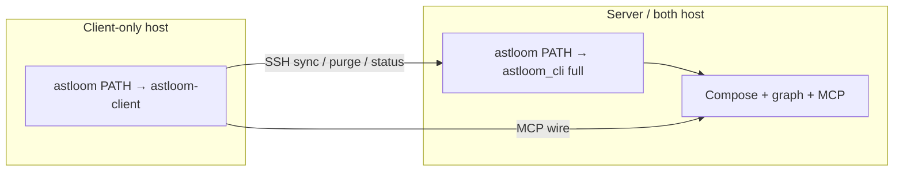

# Thin Client CLI (astloom-client) — Design

## Purpose

Separate **client-only** Astloom installs onto a thin CLI entry (`astloom-client`) so laptops cannot run server-admin commands, while **server** / **both** keep the full CLI (including client workflows without a second install). Client process control includes scoped remote purge with fail-closed security.

**Status:** approved for planning (user 2026-07-25), with explicit security bar  
**Date:** 2026-07-25  
**Scope:** Separate client entry from full server CLI; client may manage only its own connect/profile/process lifecycle (including scoped purge).

## Architecture overview



| Step | Actor | Action | Outcome |
| --- | --- | --- | --- |
| 1 | Operator | `install.sh --role client` | Thin CLI on PATH |
| 2 | Operator | `install.sh --role server\|both` | Full CLI on PATH; client commands included |
| 3 | Client host | `astloom connect` / `sync` / `purge` / `status` | Remote ops for connect.yaml scope only |
| 4 | Client host | Non-allowlisted command | Absent from parser or denied by role gate |

## Problem

Today `install.sh --role client` skips Compose but still ships the **full** `astloom` command surface (`graph`, `mcp serve`, `approval`, `service`, `purge` against local stores, etc.). Operators can accidentally (or maliciously) run server-admin operations from a client host. Remote sync/status gaps already showed that “client” was not a real trust boundary.

## Goals

1. **Two install modes:** **client-only** uses a separate thin package/entry; **server** (and `both`) keep the full CLI and can act as a client without a second install.
2. Client-only can: **connect**, manage **Usage Profile / project**, **start/stop** its own processing, **status**, and **purge its own scope** (server-side via SSH).
3. Client-only **cannot** perform other Astloom capabilities (no local stack admin, no cross-scope ops, no server governance).
4. **No new security holes** — especially around purge, SSH argv, scope spoofing, and leftover full-CLI PATH on client-only hosts.

## Non-goals

- Splitting the monorepo into separately versioned PyPI distributions (same tree, two packages/entries is enough).
- Reworking MCP tool authorization inside the gateway (out of band; IDE still talks MCP to the server).
- Multi-tenant auth beyond existing connect.yaml + SSH trust model.

## Product surface

### Client allowlist (`astloom-client`)

| Command | Purpose |
| --- | --- |
| `connect` | Wire to Astloom server; persist connect.yaml + MCP |
| `profile` / `project` | List/show/activate Usage Profile for this client project |
| `sync` | Start remote processing for **connected scope** |
| `purge` | Wipe graph data for **connected scope only** on the server (`--yes` required) |
| `status` | Proxy status/progress from server for connected scope |
| `version` / `doctor` | Local CLI health (client-safe checks only) |
| `client` | `list-mcp-clients`, `wire-remote`, `doctor-remote` |
| `path` | PATH shim for the **thin** entry |
| `upgrade client` | Refresh client venv/shim/rewire only |

Everything else is **absent** from the thin parser (not merely rejected after the fact).

### Server install (`astloom` full) — also acts as client

When the machine is installed as **server** (including `role=server` and `role=both`):

- PATH exposes the **full** `astloom` CLI only.
- That full CLI **includes** every client capability (connect, profile/project, remote sync/purge/status, MCP wire helpers, `upgrade client`, etc.).
- Operators must **not** need a second “client install” or the thin package on that host to connect outward or dogfood locally.
- Thin entry `astloom-client` is **optional** on server hosts (may exist in the venv from the monorepo install) but is **not** required for UX and must **not** replace `astloom` on PATH.

`role=both` remains “server stack + client workflows on one host” using the **same** full binary — not a dual PATH of thin+full.

### Client-only install — thin package required (**shipped**)

When the machine is **client-only** (`role=client` / skip-infra):

- Uses the thin package entry (`astloom-client` / allowlist-gated full CLI).
- PATH `astloom` → thin entry (so muscle memory stays `astloom …`).
- Full server command surface is denied by `client_allowlist.py` when `install_role()==client`.
- Implementation: `backend/packages/astloom_client/` + `backend/packages/astloom_cli/client_allowlist.py`.

## Packaging

```text
backend/packages/astloom_cli/          # full CLI (existing) — server / both
backend/packages/astloom_client/      # thin parser + dispatch — client-only installs
```

`pyproject.toml` scripts:

- `astloom` → `astloom_cli.main:main` (server/both PATH target)
- `astloom-client` → `astloom_client.main:main` (client-only PATH target; also the implementation behind client’s `astloom` shim)

Thin package **imports** allowed command handlers from `astloom_cli` (shared implementation). It must **not** re-export or register server-only subparsers.

### Install / PATH

| Install role | PATH CLI name | Thin package |
| --- | --- | --- |
| `client` | **`astloom-client` only** (remove bare `astloom` if present) | Required |
| `server` | **`astloom` only** (remove `astloom-client` if present) | Not on PATH |
| `both` | **`astloom` only** (full CLI; remove `astloom-client` if present) | Not on PATH |

Defense in depth: if `install_role(root) == "client"` and someone invokes `python -m astloom_cli.main <cmd>`, **deny** any command not on the allowlist with a clear error pointing at the thin client entry.  
Do **not** apply that allowlist gate when role is `server` or `both` — those hosts keep the full surface (client ops included).

## Remote process + purge behavior

### Sync / status (existing direction)

- Client sync always SSH-remotes to the Astloom server; interrupt must kill remote pidfile (already designed).
- Client status proxies to server when role is client / no local stack.

### Purge (new client path)

1. Require `connect.yaml` with `ssh` + scope (`tenant`, `workspace`, `project`).
2. Require `--yes` (same as today).
3. Build remote argv from **settings scope**, not from free-form CLI overrides that widen scope.
4. SSH-run server: `astloom purge --tenant T --workspace W --project P --yes`.
5. On failure, non-zero exit; do not fall back to local `GraphService.purge_scope`.

## Security model (normative)

### Trust assumptions

- Client host user can edit `connect.yaml` and their SSH key — they already control which server they hit.
- SSH access to the Astloom host is a **powerful** credential; this design does not replace SSH hardening.
- Goal: client CLI must not make it *easier* than SSH shell to harm **other** scopes or the server install itself.

### Threats and mitigations

| Threat | Mitigation |
| --- | --- |
| **T1 — Cross-scope purge** via `--tenant`/`--workspace`/`--project` flags differing from connect.yaml | Client purge **ignores** CLI scope flags that expand beyond connect scope. Effective scope = connect.yaml only. If flags are passed and disagree with connect.yaml → **hard fail** (do not silently prefer either). |
| **T2 — Local purge** on client wiping wrong/empty memory backend or surprising data | Client purge **never** calls local `cmd_purge` / local GraphService; remote-only. |
| **T3 — Missing `--yes` / scripted wipe** | Keep mandatory `--yes`; no interactive “default yes”. |
| **T4 — Command injection over SSH** | Remote argv built as argv list + existing `ssh_argv` / `shlex.quote` wrapping patterns used by remote sync; **no** string-interpolated shell from user path fields into unquoted remote shell. Prefer same pidfile/`bash -lc` discipline as sync only where required; prefer argv form for purge. |
| **T5 — Full CLI left on client PATH** | Client-only install overwrites `~/.local/bin/astloom` to thin entry; verify in `doctor` / install stage. Invoking full module on client role is gated by allowlist. |
| **T6 — Help/autocomplete reveals server ops** | Thin parser (client-only) simply does not register those commands. Server/both `--help` stays full by design. |
| **T7 — Forcing thin package on server** | Do **not** replace server PATH with thin entry. Server/both use full CLI so client workflows work without a second install. |
| **T7b — Accidental allowlist on server** | Role gate must key off `install_role == client` only; never strip server commands on `server`/`both`. |
| **T8 — Purge while sync running** | Server purge behavior unchanged; client may document “stop sync first”. Optional: refuse client purge if remote sync pidfile for that scope exists (recommended fail-closed). |
| **T9 — Spoofed `remote_root` / binary path** | Use `remote_root` from connect.yaml only; do not accept a client flag that points SSH at an arbitrary remote executable path outside settings. |
| **T10 — Exfiltration** | No new cloud upload paths; remote ops stay on configured private SSH target (existing no-cloud-exfiltration law). |

### Invariants (must hold in tests)

1. Thin entry: parsing `astloom-client service start` (or any non-allowlisted top-level) → argparse error / exit ≠ 0; command not listed in `--help`.
2. `role=client` + `python -m astloom_cli.main graph ingest …` → denied before side effects.
3. Client purge with CLI `--tenant other` while connect says `mir` → exit ≠ 0; **no** SSH purge invoked.
4. Client purge without connect.yaml / without ssh → exit ≠ 0; **no** local purge.
5. Client purge happy path mocks SSH and asserts remote argv scope == connect scope and includes `--yes`.
6. Client-only install PATH resolution for `astloom` resolves to thin main (unit or install-script test).
7. Server/`both` install PATH `astloom` resolves to full main; `connect` / client sync helpers remain available without installing thin as the primary binary.
8. Allowlist deny in `astloom_cli.main` does **not** fire when `install_role` is `server` or `both`.

## Implementation sketch

1. Add `backend/packages/astloom_client/` (`main.py`, `parser.py`, `dispatch.py`, README).
2. Extract shared “client remote purge” beside `connect_flow/remote_sync.py` (e.g. `remote_purge.py`) with scope lock helpers.
3. Wire `pyproject.toml` script + package list.
4. Update `scripts/install` PATH stage for `role=client`.
5. Gate `astloom_cli.main._dispatch` for `role=client`.
6. Docs: 36/39/41/42 + client next-steps; this spec remains SoT until product docs absorb it.
7. Tests under `tests/backend/tools/astloom-cli/` (and client package tests).

## Rollout

1. Land package + gates + tests on server repo.
2. Redeploy/rsync client hosts; re-run `install.sh --role client` or `upgrade client` so PATH points at thin entry.
3. Verify on a real client: `--help` is short; `purge --yes` remotes; `service` / `graph` absent or denied.

## Open decisions (resolved)

| Item | Decision |
| --- | --- |
| Approach | **2** — separate thin package for **client-only**; server keeps full CLI |
| Server as client | **Yes** — full `astloom` includes client workflows; no second client install |
| Client-only | **Must** use PATH name `astloom-client` only (no bare `astloom`) |
| Purge from client-only | **Yes**, own scope only, remote |
| PATH UX on client-only | `astloom-client` only |
| PATH UX on server/both | `astloom` only (full CLI; `astloom-client` not on PATH) |
| Security bar | Fail-closed scope lock; no local purge; SSH argv safety; dual gate on client role only |

## Related Documents

- [36 - Astloom CLI](../../08-software-engineering-architecture/36-astloom-cli.md)
- [39 - Local Install Runbook](../../08-software-engineering-architecture/39-local-install-runbook.md)
- [Thin Client CLI Implementation Plan](../plans/2026-07-25-thin-client-cli.md)
