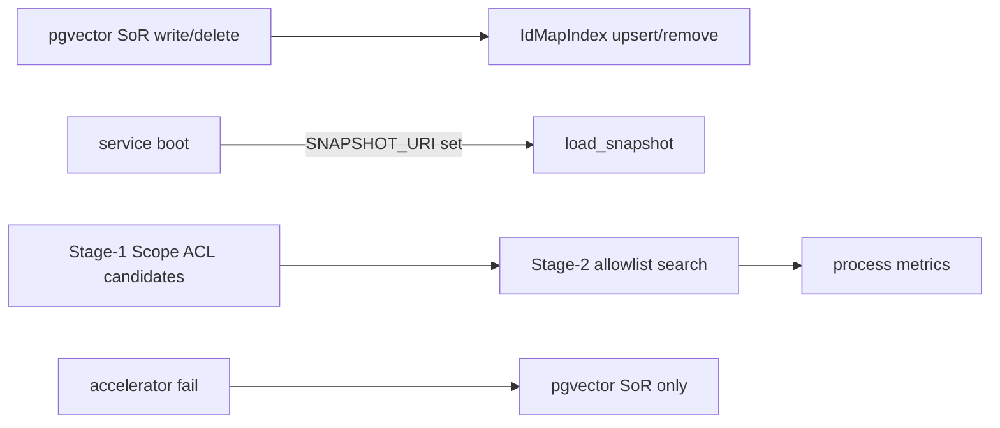

# F7 Turbovec Stage-2 Completion (Quality Package) — Design

## Purpose

Improve retrieval correctness and operator honesty for optional Turbovec Stage-2
ANN: keep the ANN replica consistent with pgvector SoR on index/delete, load/persist
local snapshots, expose process metrics, and prove project-scoped allowlist isolation.
SQL-schema ingest (backlog F7b) and `async_job` sync mode remain deferred.

## Product Workflow

| Step | Actor | Action | Outcome |
| --- | --- | --- | --- |
| 1 | Operator | Set `ASTLOOM_RAG_ANN_ACCELERATOR=turbovec` | Accelerator enabled at process start |
| 2 | Service boot | `try_build_accelerator`; optional `load_snapshot` | Replica ready or empty; fail-open to SoR |
| 3 | Index | Write embedding SoR then sync replica | SoR ahead of replica |
| 4 | Delete / decay | SoR delete then `remove` + id-map cleanup | Deleted ids never ranked |
| 5 | Retrieve | Stage-1 Scope filters → Stage-2 allowlist | Hits attributed `pgvector`/`turbovec` |
| 6 | Operator | Run `python -m vector_index.promotion_gate` before prod | Measured recall/latency |

## Shipped in this change

- `rebuild_from_rows` on `VectorIndexPort` + adapters.
- `InstrumentedVectorIndex` + `AcceleratorMetrics` process counters.
- Factory snapshot load + persist on mutation when URI set.
- Memory `index_memory_embedding` / `delete_memory_embedding` / decay sync.
- Code-graph Stage-2 only via injected durable id map (no env-only hash path).
- Isolation unit tests + memory replica consistency tests.
- Doc hygiene: backlog F7a/F7b split, notices, DI index, thin-client, ADR honesty.

## Explicitly deferred

- SQL-schema ingest (ADR `19` / F7b).
- `ASTLOOM_TURBOVEC_SYNC_MODE=async_job` worker drain.
- Cloud object-store `.tvim` beyond local/`file://`.

## Related Documents

- ADR: `docs/13-technology-stack-and-platform-decisions/08-turbovec-ann-acceleration-integration.md`
- Ops guide: `docs/13-technology-stack-and-platform-decisions/11-turbovec-for-rag.md`
- Archived backlog: `docs/07-code-knowledge-graph/34-core-product-readiness-phased-backlog.md`
