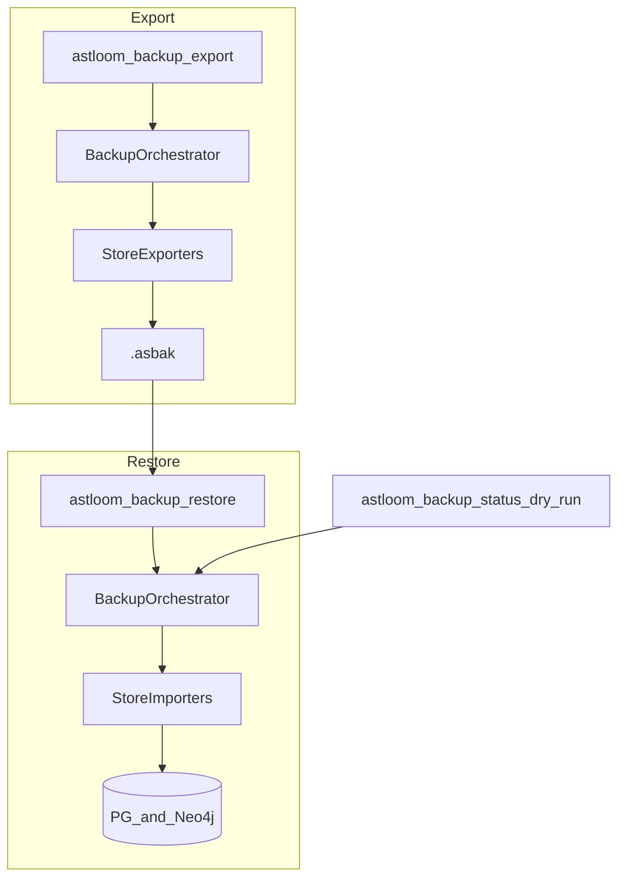

# Project Backup and Restore — Design

## Purpose

Define a portable, project-scoped backup and restore path so an operator can move
one Astloom project's analytical state (memories, core data, code graph, docs-sync,
guidance, profiles, embeddings, and related scoped rows) from one server to another
via a single `.asbak` bundle.

## Architecture overview



| Step | Actor | Action | Outcome |
| --- | --- | --- | --- |
| 1 | Operator | `astloom backup export` | `.asbak` with manifest, stores, checksums |
| 2 | Operator | Copy bundle to target host | File available offline |
| 3 | Operator | `astloom backup validate` | Version/checksum gates pass or fail-closed |
| 4 | Operator | `astloom backup restore` | Scope empty → import; non-empty → fail unless `--replace --yes` |
| 5 | Agent | MCP `status` / `dry-run` | Preview only; no large file transfer |

## Locked decisions

1. **Full analytical scope** — include embeddings; exclude broker/outbox replay and connector secrets.
2. **IDs** — preserve `(tenant_id, workspace_id, project_id)` by default; optional remap flags.
3. **Conflict** — fail-closed if target scope non-empty; replace only with `--replace --yes`.
4. **UX** — CLI owns bundle I/O; MCP exposes status and dry-run only.
5. **Ownership** — `astloom_backup` package sequences store exporters/importers (per-schema codecs);
   CLI orchestrates; services remain SoR owners of their schemas.

## Bundle format

```text
manifest.json
stores/<store_id>/<table>.jsonl
stores/code_graph/neo4j/{nodes,relationships}.jsonl
local/project.json
evidence/checksums.json
```

`manifest.json` records `schema_version`, `contract_version`, source scope, per-store
row counts, and `schema_fingerprint` (present tables per store — used as a migration
presence gate on restore). Archive container is gzip-compressed tar with `.asbak`
suffix. Restore verifies imported counts against the manifest and fails closed on
shortfalls.

## Failure and security

- Checksum or contract mismatch → stop before writes.
- Secret-like patterns in payload → reject export/import.
- Partial restore failure → stop; report failing store; no silent success.
- Adapter store exports metadata only (no credential material).

## Install and packaging

- Python package `astloom_backup` is listed in `pyproject.toml` and installs with
  `pip install -e .` / wheelhouse / Docker `COPY backend/packages`.
- `scripts/ensure-venv.sh` and `astloom doctor` import-check `astloom_backup`.
- MCP tools ship in `backend/configs/usage-profiles/programming-cursor-mcp.json`
  (copied with `backend/configs` on server images).
- Thin client CLI allowlist does **not** include `backup` (server/both only).

## Verification

- Unit tests for manifest, checksums, conflict policy, remap, secret scan, ports, MCP handlers.
- Integration round-trip for Postgres-backed stores when `ASTLOOM_DATABASE_URL` is set.
- Neo4j export/import when Neo4j is configured; refuse export when graph store is neo4j
  but password is unset/placeholder.
- Operator runbook:
  `docs/09-platform-governance-operations/13-project-scoped-backup-and-restore.md`.

## Related Documents

- [Operator runbook](../../09-platform-governance-operations/13-project-scoped-backup-and-restore.md)
- [Data retention, backup, and disaster recovery](../../09-platform-governance-operations/04-data-retention-backup-and-disaster-recovery.md)
- [Storage ownership matrix](../../13-technology-stack-and-platform-decisions/13-storage-ownership-matrix.md)
- [CLI reference part 4](../../08-software-engineering-architecture/42-astloom-cli-command-reference-part-4.md)
- [Package boundary](../../../backend/runbooks/backup-restore/README.md)
