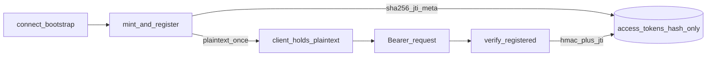

# API-only HTTPS migration without SSH

## Purpose

Make Astloom an **HTTPS-only product** for clients: connect, MCP, sync
(content-push), purge, and status. Remove **all** SSH product paths (code, client
config, docs). Keep security approachable: edge TLS with **auto-generated certs**,
a single **long-lived scoped access token** (plaintext returned once to the client;
**SHA-256 digest only** in Postgres), and **Argon2id** for the bootstrap secret —
without OIDC in phase 1. There is no refresh-token flow: clients re-bootstrap
(re-run `astloom connect`) to mint a new access token once the current one
expires.

## Approaches considered

| Option | Idea | Trade-off |
| --- | --- | --- |
| A — Keep SSH + optional HTTP | Dual transport forever | Enterprise ops burden; rejected |
| B — HTTPS + OIDC/SSO first | Full IdP | High complexity for on-prem; deferred |
| C — HTTPS + long-lived access token + auto-CA (selected) | One edge, one scoped token, local CA | No SSO yet; sufficient for private Enterprise |

**Recommendation:** C.

## Goal / non-goals

**Goals**

- Absolute zero SSH in Astloom product (CLI client, connect.yaml schema, MCP wiring, docs).
- All client traffic over **HTTPS** (fail closed on `http://` except explicit lab/loopback).
- **Auto TLS:** if cert/key missing, generate private CA + server cert under data root.
- **Access token**: single long-lived scoped token (30 days); no refresh/rotation. Re-bootstrap on expiry.
- **Access token at rest**: SHA-256 digest + `jti`/scope/`expires_at`/`revoked_at` in
  `project_profile.access_tokens` — never store the raw Bearer string in the DB.
- **Argon2id** hashes for the bootstrap secret at rest.
- Content-push only for sync; no remote `sync --path` over SSH.

**Non-goals (phase 1)**

- OIDC/SSO / Entra / Keycloak.
- mTLS between edge and backends.
- Public ACME/Let’s Encrypt as the only cert path (optional later).
- Changing Neo4j/Postgres client protocols (remain on private backend net).
- Host SRE shell access (outside this product).

## Architecture

```mermaid
flowchart LR
  client[astloom_client]
  edge[HTTPS_edge]
  mcp[MCP_gateway]
  profile[project_profile]
  graph[code_graph]
  certs[Auto_TLS_certs]

  certs --> edge
  client -->|TLS_access| edge
  edge --> mcp
  edge --> profile
  edge --> graph
```

| Step | Actor | Action | Outcome |
| --- | --- | --- | --- |
| 1 | Install / serve | Ensure TLS material under data root | Cert+key exist (created if missing) |
| 2 | Edge | Terminate TLS; proxy `/mcp`, `/api/…` | Backends not public |
| 3 | Client | `connect` with HTTPS URL + bootstrap | Access token issued |
| 4 | Client | Call MCP/graph/connect with access Bearer | Authorized work |
| 5 | Client | On 401 / expiry | Re-run `astloom connect` to re-bootstrap; new token minted |

## TLS auto-certificates

**Layout (SoT):** `<ASTLOOM_DATA_ROOT>/certs/`

| File | Role |
| --- | --- |
| `ca.pem` / `ca.key` | Private CA (client trust) |
| `server.pem` / `server.key` | Leaf for `ASTLOOM_PUBLIC_HOSTNAME` |
| `.astloom-certs.json` | Marker: hostname, not_after, generated_at |

**Rules**

1. If operator-supplied `ASTLOOM_TLS_CERT` + `ASTLOOM_TLS_KEY` point to existing files → use them; do not auto-gen.
2. Else if `server.pem` + `server.key` already exist and are unexpired → reuse.
3. Else generate CA (if missing) + leaf for hostname (default install FQDN / `localhost` lab).
4. Never log private keys. Mode `0600` on keys.
5. Connect bootstrap exposes **CA PEM** (or fingerprint + fetch URL) so clients verify TLS without `verify=False`.
6. Renew auto-generated leaf before expiry (same module, non-interactive).

## Auth: long-lived access token + Argon2id



| Step | Actor | Action | Outcome |
| --- | --- | --- | --- |
| 1 | Bootstrap | Mint `as1.*` with unique `jti` | Plaintext returned once in HTTPS response |
| 2 | Registry | Store SHA-256 digest + scope + `expires_at` | No raw-token column in Postgres |
| 3 | Client | Send `Authorization: Bearer` | Connect APIs receive token |
| 4 | Verifier | HMAC + scope, then `assert_active(jti, hash)` | 401 if missing, hash mismatch, revoked, or expired |
| 5 | Operator | `revoke(jti)` or wait for expiry / re-bootstrap | Old bearer fails closed |

### Access token

- Single scoped bearer (`as1.*` HMAC in `usage_profile.mcp_tokens`, wrapped by
  `astloom_auth.mint_access_token` / `mint_and_register_access_token`).
- Default TTL: **30 days** (`86400 * 30`; matches the underlying `mint_connect_token` default).
- Claims: `tenant_id`, `workspace_id`, `project_id`, `exp`, `jti` (+ actor when available).
- Sent as `Authorization: Bearer …` on MCP, graph mutate, connect APIs after mint.
- No refresh/rotation: once expired, the client re-bootstraps (re-runs
  `astloom connect`, providing the bootstrap secret again if one is
  configured) to mint a fresh access token. A 401 never triggers an automatic
  retry — callers fail closed with a message pointing at re-bootstrap.

### Argon2id floors (normative)

| Parameter | Minimum |
| --- | --- |
| Variant | Argon2id |
| `time_cost` | 3 |
| `memory_cost` | 65536 (64 MiB) |
| `parallelism` | 4 |
| Hash library | `argon2-cffi` (explicit dependency) |

Bootstrap operator secrets stored server-side use the same Argon2id floors.
Access tokens use **SHA-256** digests for at-rest lookup (high-entropy bearer;
Argon2id remains reserved for low-entropy bootstrap secrets).

### Access token at-rest storage

Minted `as1.*` access tokens carry a unique `jti` claim. `astloom_auth.token_registry`
persists only the **SHA-256 hex digest** of each token plus scope metadata
(`tenant_id`, `workspace_id`, `project_id`, `expires_at`, `revoked_at`) —
`project_profile.access_tokens` never has a plaintext/raw-token column. Every
Bearer check on connect routes verifies the HMAC signature and scope claims
first, then asserts liveness (found, hash-matched, not revoked, not expired)
against the registry via `verify_registered_access_token`. The static shared
MCP HTTP token (non-`as1.*`, lab fallback) carries no `jti` and skips the
registry. Prefer Postgres when
`ASTLOOM_PROJECT_PROFILE_DATABASE_URL` (or the service DSN) is available;
otherwise an in-memory registry is used for unit TestClient only.

### Bootstrap

1. Operator (or install) creates a one-time bootstrap secret (hashed at rest with Argon2id).
2. Client `astloom connect` posts HTTPS bootstrap with that secret + scope.
3. Server mints and **registers** the access token (hash at rest), returns plaintext
   access token + CA trust material + public API/MCP URLs once.
4. No SSH key install; `connect.yaml` has no `server.ssh`.
5. Re-run the same bootstrap call to mint a new access token once the old one expires.

## Product path changes

| Capability | After migration |
| --- | --- |
| MCP | Streamable HTTP only (`serve-http` behind HTTPS edge) |
| Sync | Content-push HTTP only |
| Register / status / purge | HTTPS APIs only |
| Install-root SSH discovery | Removed; public URL configured |
| `source.server_path` client probe | Removed from product |
| Remote `sync --path` | Removed from client product |

## Security bar

1. HTTPS only (lab override explicit env, not default).
2. Bearer access required on client-facing mutate/control routes.
3. Bootstrap secret at rest = Argon2id only.
4. Access token at rest = SHA-256 digest + metadata only; never store raw Bearer in DB.
5. Auto-certs or operator certs; no plaintext HTTP edge in production profile.
6. Scope from token claims; do not trust spoofable headers alone when Bearer present.
7. No SSH modules in product packages; CI rejects `server.ssh` in connect schema.
8. No refresh-token flow: 401 fails closed with a re-bootstrap message, never an
   automatic retry using a stored secret.

## Phased delivery

| Phase | Deliverable |
| --- | --- |
| 0 | This design + implementation plan |
| 1 | Cert auto-gen, access token + Argon2id, Bearer on connect APIs, HTTPS client enforce, edge recipe |
| 2 | HTTPS purge/status; HTTPS-only wizard; drop SSH push/MCP fragments |
| 3 | Delete SSH code/docs/tests; CI guard |
| 4 | Rate limits, cert renew, security regressions |
| 5 | Remove refresh-token flow entirely (YAGNI): single long-lived access token, re-bootstrap on expiry |
| 6 | Hash-at-rest access-token registry (`jti` + SHA-256); register on mint; verify+revoke on connect Bearer |

## Verification

- Unit: cert create-once; Argon2id accept/reject; access token mint/verify.
- Unit: token registry register / hash mismatch / revoke → fail; raw token never stored.
- Unit: HTTPS scheme fail-closed; connect schema rejects `server.ssh`; 401 fails closed with re-bootstrap hint (no retry).
- Integration: bootstrap → MCP call → content-push with access token.
- Live: fresh install without pre-existing certs serves HTTPS; laptop connect without SSH.

## Related Documents

- Implementation plan: [2026-08-04-api-only-https-migration.md](../plans/2026-08-04-api-only-https-migration.md)
- Onboarding: [41](../../08-software-engineering-architecture/41-one-command-cross-platform-agent-onboarding.md), [41-continued](../../08-software-engineering-architecture/41-one-command-cross-platform-agent-onboarding-continued.md)
- Content-push: [client-direct-ingest-no-stage](./2026-08-04-client-direct-ingest-no-stage-design.md)
