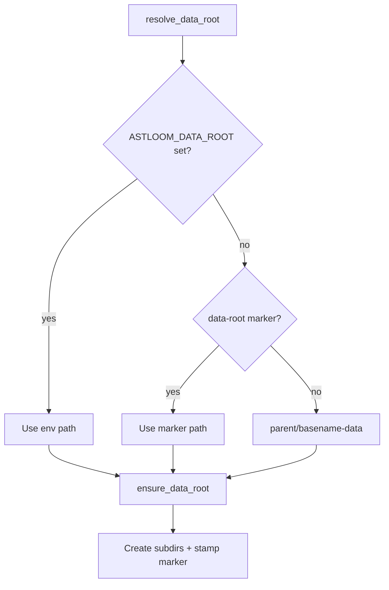

# Astloom data root beside install

## Purpose

Keep durable runtime data next to the Astloom install tree so operators can
back up, move, or wipe data without hunting Docker volume IDs or `/var/lib`.

## Layout

Given install root `/opt/Astloom` (or any `ASTLOOM_ROOT`):

```text
/opt/Astloom/                 # code, .venv, lightweight .astloom
/opt/Astloom-data/            # default sibling: <basename>-data
  postgres/                     # Compose bind → container /var/lib/postgresql
  neo4j/                        # Compose bind → container /data
  backup/                       # backup job metadata (+ archives when local)
  cache/                        # docs-catalog and similar caches
  mcp-usage/                    # MCP usage JSONL
  sync-usage/                   # sync usage reports
  run/client-sync-jobs/         # live client ingest-push job snapshots (server)
```

Override: `ASTLOOM_DATA_ROOT` or install flag `--data-root PATH`. Interactive
server/both install prompts with Enter = sibling default; choice is persisted as
`data_root=` in `.astloom/install-state.env`.

## Resolve and ensure flow



| Step | Actor | Action | Outcome |
| --- | --- | --- | --- |
| 1 | Install / CLI | Call `resolve_data_root(install_root)` | Concrete data-root path |
| 2 | Install / CLI | Call `ensure_data_root` | Subdirs exist; marker stamped |
| 3 | Compose | Bind-mount Postgres/Neo4j under data-root | Durable volumes beside install |

## Stays under install `.astloom/`

`install-state.env`, `install-root`, `identity.yaml`, `connect.yaml`,
`upgrade-jobs/`, `upgrade-backups/`, `upgrade-evidence/`, `run/` (pids/logs),
`mcp-http.secret`, `projects/` registry JSON.

## Resolver

`resolve_data_root(install_root)`:

1. `ASTLOOM_DATA_ROOT` if set
2. else `<install>/.astloom/data-root` marker
3. else `<parent>/<install_basename>-data`

`ensure_data_root` creates the subdirs, stamps the marker, and one-shot copies
legacy nonempty `.astloom/{backup,cache,mcp-usage,sync-usage}` into the data
root when those dest dirs are empty.

Remote install discovery reads the server marker (or `data_root=` in
`install-state.env`) so custom `--data-root` installs resolve correctly.

## Compose

Replace named Docker volumes with bind mounts driven by `ASTLOOM_DATA_ROOT`.

## Migration

On first bring-up, if bind dirs are empty and legacy named volumes
`astloom_astloom-postgres-data` / `astloom_astloom-neo4j-data` exist,
copy volume contents into the bind dirs once (best-effort). Never delete the
old volumes automatically.

## Non-goals

- Moving upgrade job state out of `.astloom`
- Changing Postgres/Neo4j ports or credentials
- Client-only hosts creating Compose data dirs

## Related Documents

- [Server CLI tracking for live client sync jobs](./2026-08-10-server-client-sync-jobs-cli-design.md)
- [Local install runbook](../../08-software-engineering-architecture/39-local-install-runbook.md)
