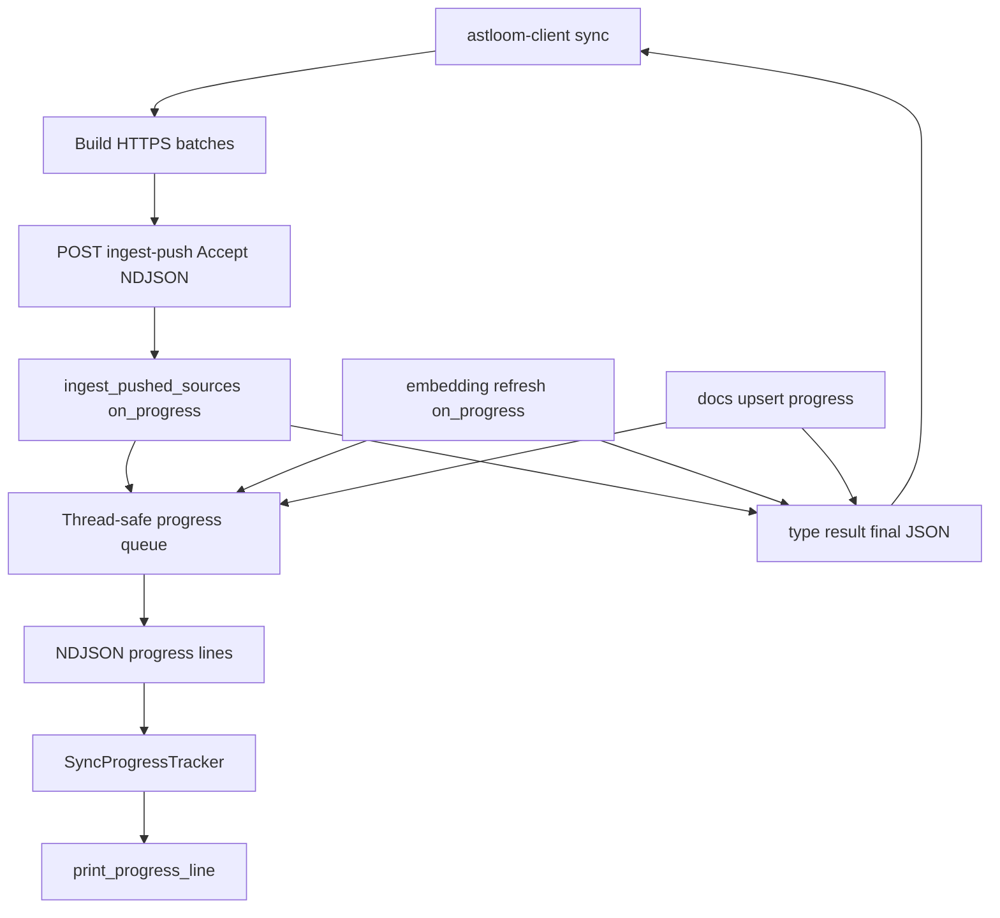

# Client content-push sync progress stream (server parity)

## Purpose

`astloom-client sync` must show the **same live progress UI** as local
`astloom sync` (percent bar, phase done/total, ETA, rate, queue, symbols/edges,
parallel workers, optional rpm, docs/embeddings phases). Today the client prints
only a batch start line and waits for a single JSON `ingest-push` response.

## Approaches considered

| Option | Idea | Trade-off |
| --- | --- | --- |
| A — NDJSON on same `POST …/ingest-push` (selected) | Opt-in stream of progress + final result | Smallest new surface; backward compatible |
| B — SSE (`text/event-stream`) | Browser-friendly events | Extra framing; no gain for CLI |
| C — Async job + poll | Separate progress resource | State/TTL/cleanup; rejected for YAGNI |

**Recommendation:** A. Client always requests the stream; servers that ignore the
header keep JSON-only behavior until upgraded.

## Goal / non-goals

**Goals**

- Live server-side progress events during content-push ingest (code → optional
  embeddings → optional docs), rendered via existing `SyncProgressTracker` /
  `print_progress_line`.
- Honor `--progress-interval` the same way as local sync.
- Keep non-stream requests returning a single JSON result (scripts / older clients).
- Fail closed on stream protocol errors with an actionable client message.

**Non-goals**

- Fake client-only upload percent as a substitute for ingest progress.
- WebSocket transport.
- Changing the visual layout of `print_progress_line`.
- Reviving SSH content-push.

## Architecture

| Step | Actor | Action | Outcome |
| --- | --- | --- | --- |
| 1 | Client | Discover + hash-skip; open `SyncProgressTracker` | Same interval as local sync |
| 2 | Client | `POST ingest-push` with `Accept: application/x-ndjson` | Stream mode |
| 3 | Server | Wire `on_progress` → queue; run ingest (+ embeddings) | Progress events |
| 4 | Server | Optional docs upsert with `phase=docs` events | Docs parity |
| 5 | Client | Parse each NDJSON line; `tracker(event)` / `begin_phase` | Live UI |
| 6 | Server | Emit `{"type":"result", …}` then close | Client totals + exit code |

## Wire protocol

**Request:** unchanged body. Opt-in via:

- `Accept: application/x-ndjson`, or
- query `stream=1` (defense in depth for proxies that strip Accept).

**Response (stream mode):** `Content-Type: application/x-ndjson`

| Line `type` | Payload | Notes |
| --- | --- | --- |
| `progress` | Same fields `SyncProgressTracker` already consumes (`phase`, `done`, `total`, `file`, `status`, symbols/edges, in-flight, rpm fields when present) | One event ≈ one `on_progress` call |
| `result` | Current JSON success body (`files_*`, optional `docs`, `embedding_refresh`) | Exactly once, last success line |
| `error` | `{ "message": "…" }` | Terminal; no following `result` |

**Non-stream mode:** existing single JSON object (no NDJSON wrapper).

## Service / CLI seams

| Seam | Change |
| --- | --- |
| `api/ingest.py` `ingest_push` | Detect stream request; run ingest in worker thread; yield NDJSON; docs phase emits progress |
| `pushed.ingest_pushed_sources` | Already emits `on_progress` (including embeddings) — reuse |
| `client_push._run_ingest_push_http` | Stream read; feed tracker; return result dict |
| `client_push.client_push_sync` | Construct tracker; `begin_phase` across batches/phases |
| Tests | Unit: stream framing + non-stream compat; client parser → tracker calls |

## Security / sovereignty

- Same bearer / loopback auth as today; do not weaken auth for streams.
- Progress lines must not include file source bodies.
- Truncate `file` paths in events the same way the tracker/UI already does.
- Payload stays on the private HTTPS trust boundary (no cloud exfiltration).

## Verification

- Unit: non-stream `ingest-push` still returns plain JSON.
- Unit: stream emits `progress` then `result`; error path emits `error` only.
- Unit: client maps progress events into `SyncProgressTracker` (interval honored).
- Integration/unit: docs phase events when `docs[]` present.
- Manual: `astloom-client sync` shows percent / ETA / symbols during a large batch.

## Related Documents

- [Client direct ingest without durable source stage](./2026-08-04-client-direct-ingest-no-stage-design.md)
- [Client sync auto discovery and inventory-complete prune](./2026-08-10-client-sync-auto-discovery-inventory-design.md)
- [Server CLI tracking for live client sync jobs](./2026-08-10-server-client-sync-jobs-cli-design.md)
- [API-only HTTPS (no SSH)](./2026-08-04-api-only-https-no-ssh-design.md)
- CLI progress behavior: `docs/08-software-engineering-architecture/42-astloom-cli-command-reference-continued-continued-continued.md`
