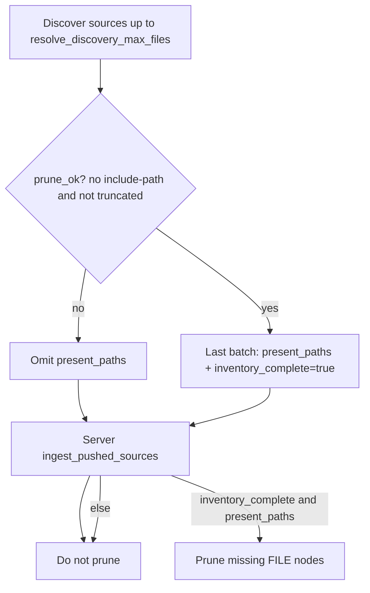

# Client sync auto discovery, HTTP batching, and inventory-complete prune

## Purpose

Document the shipped contract for `astloom-client sync` discovery defaults,
HTTP batching, and fail-closed graph prune. Operators must not confuse a single
HTTP batch size (~hundreds of files) with the discovery cap, and partial or
scoped syncs must never delete other graph files.

## Approaches considered

| Option | Idea | Trade-off |
| --- | --- | --- |
| A — Soft default `max_files=2000` | Cap discovery unless operator overrides | Truncated trees; false prune risk if `present_paths` sent | Rejected |
| B — Auto full tree to hard cap + HTTP batching (selected) | Default `max_files=0` discovers up to `HARD_SYNC_MAX_FILES` (20 000); wire payloads split by size/file caps | Multi-batch sync; longer first run |
| C — Always require explicit `max-file N` | No silent default | Forces every operator run; easy to under-sync |

**Recommendation:** B.

## Discovery contract

| Input | Behavior |
| --- | --- |
| No `max-file` / `max_files<=0` (default) | **Auto:** `resolve_discovery_max_files` → `HARD_SYNC_MAX_FILES` (20 000) |
| Explicit `max-file N` | Cap discovery at `min(N, HARD_SYNC_MAX_FILES)` |
| Hit hard cap | Warning; inventory treated as truncated → prune off |

CLI note line reports `max_files=auto/20000` when auto, else the explicit cap.
`present` counts discovered sources after secret-path skips; `push` is bodies
that differ from remote `file-hashes`.

## HTTP batching (not the discovery cap)

Within one sync, changed files are split into batches:

| Cap | Value | Role |
| --- | --- | --- |
| `_MAX_BATCH_BYTES` | ~4 MiB JSON | Avoid oversized `ingest-push` bodies |
| `_MAX_BATCH_FILES` | 1500 | Bound per-request file count |

Example: tree of ~4284 sources may become `batches=6` with first batch ~815
files — that number is a **batch** size, not a discovery soft default of 2000.

Each request still advertises `max_files=HARD_SYNC_MAX_FILES` for server schema
bounds. Progress NDJSON and `astloom sync jobs` advance per in-flight batch.

## Authoritative inventory and prune

| Step | Actor | Action | Outcome |
| --- | --- | --- | --- |
| 1 | Client | Resolve discovery cap (auto or explicit) | Candidate paths |
| 2 | Client | Compute `prune_ok` = not `--include-path` and not truncated | Authoritative vs partial |
| 3 | Client | If not `prune_ok`, omit `present_paths` | Partial sync cannot advertise inventory |
| 4 | Client | If `prune_ok`, last batch sets `present_paths` + `inventory_complete=true` | Explicit full inventory |
| 5 | Server | Prune only when both flags/lists authorize | Fail-closed: `present_paths` alone never deletes |

Scoped (`--include-path`) or truncated syncs print `prune=off`. Full auto tree
prints `prune=on` when inventory is authoritative.

## Operator surfaces

| Surface | What to expect |
| --- | --- |
| `astloom-client sync` note | `present`, `push`, `unchanged_skip`, `batches`, `docs`, `prune`, `max_files=auto/…` |
| `push batch i/N` | HTTP batch progress (not discovery) |
| Server `astloom sync jobs` | Live `done/total` for current batch job |

## Verification

| Check | Evidence |
| --- | --- |
| Unit | Auto vs explicit `resolve_discovery_max_files`; omit `present_paths` when not `prune_ok`; server ignores prune without `inventory_complete` |
| Live | Client without `max-file`: `present>2000`, `batches>=2`, `max_files=auto/20000`, docs count >0 when filters enabled; server jobs advance |

## Related Documents

- [Client direct ingest without durable source stage](./2026-08-04-client-direct-ingest-no-stage-design.md)
- [Client content-push sync progress stream](./2026-08-05-client-push-progress-stream-design.md)
- [Server CLI tracking for live client sync jobs](./2026-08-10-server-client-sync-jobs-cli-design.md)
- [CLI command reference part 4 — sync jobs](../../08-software-engineering-architecture/42-astloom-cli-command-reference-part-4.md)
- [Onboarding continued — content-push](../../08-software-engineering-architecture/41-one-command-cross-platform-agent-onboarding-continued.md)
